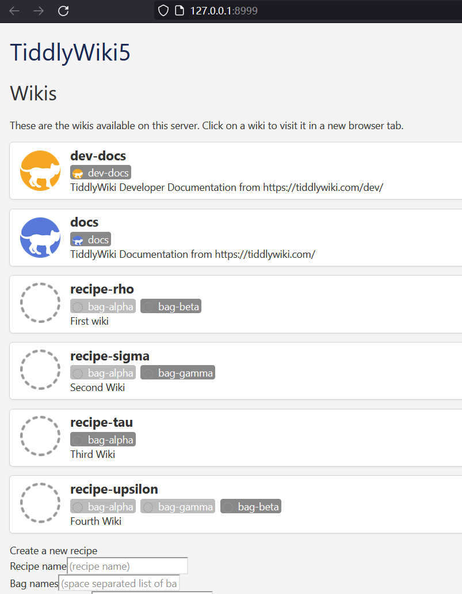
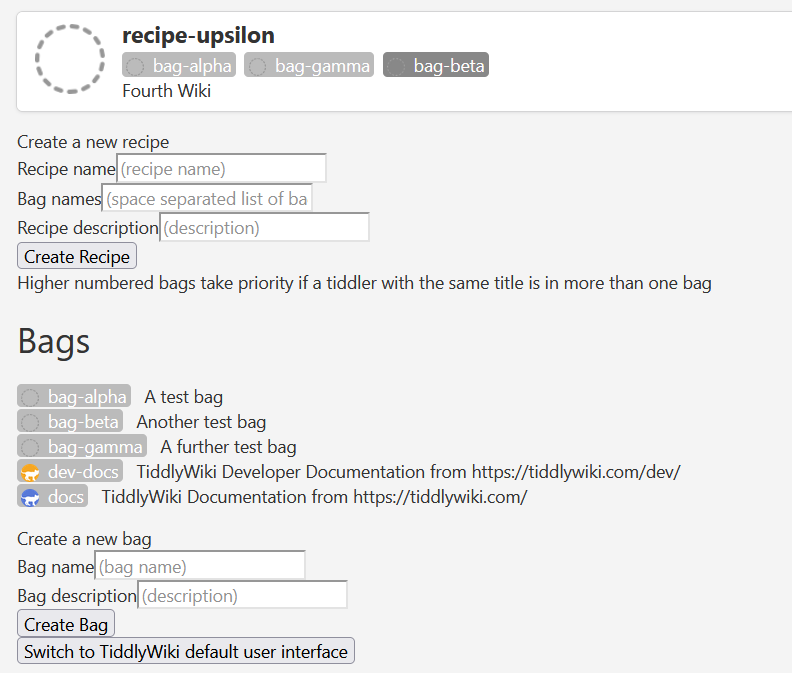
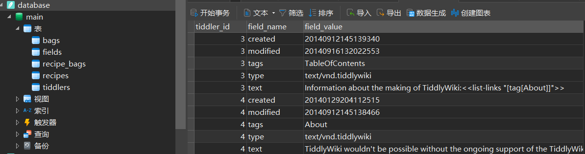

# MultiWikiServer

原文由[fspark](https://talk.tidgi.fun/user/fspark)编写，最先发布于[太微中文论坛](https://talk.tidgi.fun/topic/124/tw%E5%89%8D%E7%9E%BB-multiwikiserver-%E9%94%90%E6%84%8F%E5%BC%80%E5%8F%91%E4%B8%AD%E7%9A%84%E5%AE%98%E6%96%B9%E5%A4%9A%E7%BB%B4%E5%9F%BA%E6%9C%8D%E5%8A%A1%E5%99%A8-%E6%9C%AA%E6%9D%A5%E5%8F%AF%E6%9C%9F)。

## 官方多维基服务器

- [Announcing the MultiWikiServer Plugin \- Discussion \- Talk TW](https://talk.tiddlywiki.org/t/announcing-the-multiwikiserver-plugin/9033/16)
- [MultiWikiServer and SQLite \- Developers \- Talk TW](https://talk.tiddlywiki.org/t/multiwikiserver-and-sqlite/9035)
- [Introduce "Multi Wiki Server" Plugin by Jermolene · Pull Request #7915](https://github.com/Jermolene/TiddlyWiki5/pull/7915)

## 目标

- 同时托管多个维基，并通过“配方/袋子”机制在它们之间共享数据
- 改进了文件上传和附件的处理，允许上传和流式传输千兆字节的视频文件
- 服务器和所有连接的客户端之间的更改即时同步
- 服务器上的工作流处理，例如自动压缩图像或存档网页
- 强大的身份验证和授权选项

## 配方/袋子模型

TW 越来越像海鲜市场了（笑）
顾名思义，把 Tiddlers (小鱼）装进 Bag（袋子）中，再根据不同的 Recipe （配方/食谱) 组合再与 Template （模板）一起渲染（烹饪）成最终的 Wiki （菜）。

以下是官方定义的规则：

- “条目”被存储在命名的“袋子”里
- 袋子有访问控制，决定哪些用户可以读取或写入它们
- 配方是按优先级从低到高排列的袋子的命名列表
- 配方中的条目会按照优先级顺序，从每个袋子中依次收集。因此，如果不同袋子中有标题相同的多个条目，则会使用优先级最高的袋子中的条目作为配方的条目
- 托管的维基是通过将相应配方中的条目拼接到标准的 TW5 HTML 模板中来构建的

## 入口界面

初始界面为多 wiki（配方）的入口，配方即为袋子的自由组合（依照顺序级联覆盖）



## 存储结构

服务端一改以往的 tiddlers 文件夹，转而使用单一 SQLite 数据库文件。



## 内存占用

因为不再将所有 tiddlers 常驻内存所以大幅减小。


## 尝鲜

```bash
git clone https://github.com/Jermolene/TiddlyWiki5.git --branch multi-wiki-support
cd TiddlyWiki5
pnpm i
node ./tiddlywiki.js ./editions/multiwikiserver --listen port=8080
```

## 再看看

- [Developer demo of alternate wiki store implementation #7329](https://github.com/Jermolene/TiddlyWiki5/pull/7329)
  - 浏览器中的 WASM SQLite 存储
