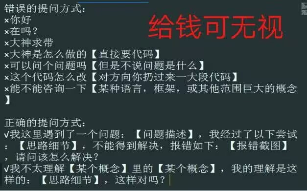

# 导言

这一栏目旨在帮助用户认识太微是什么，快速上手太微，最终能够达到使用太微，保存笔记的地步。

## 太微和太微漫游是什么？

太微是对 tiddlywiki 的中文翻译，后面的文档中会视情况使用 tiddlywiki 和太微两个名词，但指向都是一样的。

太微漫游是本文档，旨在从最基础的内容开始写起，让新手以最快的速度了解 tiddlywiki，了解太微生态，并上手使用。太微漫游从太微之书发展而来，但改名有两个原因。一个是换了静态网站展示的框架。另一个则是想表达更多的内涵。因为这趟旅程，不管是对编写者来说，还是对学习者来说，都是艰辛的，但我相信会有所收获的。

## tiddlywiki 是什么？

tiddlywiki 是一款具有接近二十年（明年就 20 年了）发展历史的网页程序。最早是由杰里米开发，现在已经是一个不断发展的开源项目，越来越多的人参与到这个项目进来。

在 2014 年，杰里米完成了对 tiddlywiki 的重构，并发布新版本 tiddlywiki5，目前的版本号都是在 tiddlywiki5 下进行的，最新版本是 5.3.3。

## 为什么你该使用 tiddlywiki？

### 软件本身

- 开源免费
- 本地优先
- 多种部署
- 可使用 git 记录提交
- 插件丰富，生态完善
- 近 20 年发展历史
- 功能强大、自定义程度高

tiddlywiki 本身是一个 HTML 网页文件，完整地包含了各种程序代码、样式表文件。如果安装了插件，插件也会完整地保存进去。

同时 tiddlywiki 又可通过 nodejs 进行部署，以更细粒化的方式进行保存备份。

而 tiddlywiki 本身可以直接实现当下笔记软件所具有的多个功能，比如标签、链接、模板化使用、自动化运行。

其次，tiddlywiki 及生态也在不断发展，拥有五百多个插件，选择一些插件就可以配置出属于自己的 tiddlywiki 了。

并且 tiddlywiki 本身是开源免费的，所以完全不用担心 tiddlywiki 会出现开发者跑路的问题。

tiddlywiki 这种把数据和程序几乎完全绑定在一起的方式，我以为是比 obsidian 拆分两者是要更好的。数据离不开程序运行，而程序需要数据来支撑。而硬要拆分两者，就只能选择基础通用的功能，无法在更高更复杂的情况下实现更多的需求。

### 更多的链接！！！

tiddlywiki 可以实现各种各样的功能，比如写关于某个项目的小册子，或者用来记日记，或者是做成商业展示网页。不过最多的还是打造成个人笔记系统和个人博客。把笔记系统写出来的内容发布公开就成了个人博客。博客也可以视作是数字花园。

最早的笔记软件一般只有标签加文件夹功能。而第二代笔记软件，大部分是在前面的基础上加上了双链和模板的功能。而不同的笔记软件还有不同之处，比如动态表格，比如大纲笔记，比如白板笔记。但这些只有动态表格 tiddlywiki 实现得比较好，大纲笔记和白板笔记还有欠缺。

而作为笔记系统，tiddlywiki 和其他笔记软件最大的不同就在于，tiddlywiki 有**更多且更丰富**的链接。标题和标签是最基本的链接，加上双链，再加上条目的字段内容也可以生成链接。而 tiddlywiki 推崇把单个条目上写成多个更小的片段。以保证能够重复使用一些笔记。所以这就导致了，可能在其他笔记系统里，一个 markdown 文件，可以写几千字甚至上万字，而在 tiddlywiki 里则只推荐写几百字到两千字左右。超过两千字的，我个人会重新处理，再分成几个条目。

这也就导致了 tiddlywiki 的链接非常多，数量级完全不一样。如果你不喜欢这样太碎、太多链接，那你可能不适合用 tiddlywiki 来写笔记。

不过没关系，你也可以把 tiddlywiki**当成游戏**来体验下，tiddlywiki 也是一个很有意思的玩具。

### 更多的拓展

如果你是前端程序员，那么你更能探索 tiddlywiki 了。因为 tiddlywiki 支持 html 和 javascript，你可以操作 javascript 来进行更为丰富的操作。但**本文档会尽可能避免 javascript 内容**，原因很简单，我也不会 javascript。后面高阶内容里，可能会简单涉及，但主要是与插件相关的。

## 为什么会写这份文档？

目前已经有很多 tiddlywiki 教程了。但不管是官方文档，还是太微中文教程，还是 tiddlywiki-xp，都是以 tiddlywiki 自身的形式展示的。而新手又不了解 tiddlywiki，结果就导致了新手很多时候连基本的 tiddlywiki 教程都看不完，或者看不全，然后上手使用 tiddlywiki，就会发现遇到了各种各样的问题，而难以解决，最终放弃。这是很可惜的。当然最主要的还是，很多人连 tiddlywiki 是什么都没听说过。如果他们了解过 tiddlywiki，也许他们对笔记软件的看法会发生改变。

现在打算以 markdown 的形式，按照通行教程思路，一步步演示 tiddlywiki 应该如何上手使用。

## 资源下载

因为 tiddlywiki 很多内容都放在了 github 上，而 github 国内又访问不是很方便。所以我建了一个 QQ 群，里面用来存放资料。里面开启禁言，如果想要讨论，可以前往大群里讨论或者去太微中文论坛里讨论。

- [QQ 资料群 854373088](http://qm.qq.com/cgi-bin/qm/qr?_wv=1027&k=mjGbVUANLPdTVRHeucfKMoqPANEFkl2G&authKey=xoTJ%2FYfOSjrsiuz2qjKuCPvEVEc%2BhMw0aRafEhBAFJUZ5CTNfye2DyUMC54gAW9d&noverify=0&group_code=854373088)
- [QQ 讨论群 946052860](http://qm.qq.com/cgi-bin/qm/qr?_wv=1027&k=NvkTXZV0144wvZpvdfGGnA9f8uqZDbp3&authKey=5OkrQ%2BUiKMivyuvmapTwYF3ItI%2BV8Ns2j7mPDLq8BxJqLZiuLbIV9Ex8FBtFlwdn&noverify=0&group_code=946052860)
- [太微中文论坛](https://talk.tidgi.fun/topic/6/%E7%BE%A4%E5%85%AC%E5%91%8A-%E6%9D%A5%E8%87%AAqq%E7%BE%A4)

我更喜欢在论坛里讨论问题，可以保存讨论内容，帮助到后来者，也更方便管理。

当然也欢迎在本项目仓库里提 issue，issue 看到了也会回复的。

## 正确合理提问-更快解决问题

tiddlywiki 是一个复杂的工具，功能强大，可以用来创造和实现很多内容。

但新手在实现之前会遇到各种各样的问题。比如想实现某个需求，不知道怎么写微件或者宏。不知道有什么插件等。而同时 tiddlywiki 又有着将近二十年的发展历史。有很多问题实际上是已经解决过的。但新手同样不知道。而有些问题就会反复提问。提问不要紧，但反复提问就有些浪费时间了。既浪费提问者的时间，也浪费回答者的时间。要知道程序员的时薪可是很贵的。所以也欢迎更多的人加入论坛中帮助别人回答问题，共建太微中文社区。

当然，如果有条件，尽可能向 AI 提问，这样也省去了向大佬提问，自己也能更快知道答案。目前太微中文社区也在做跟 AI 相关的工作。希望有一天能用 AI 来解决更多的问题。

其次，正确的提问，有助于更快解决问题。这方面的内容请看[提问的智慧](https://github.com/ryanhanwu/How-To-Ask-Questions-The-Smart-Way/blob/main/README-zh_CN.md)。文档我也添加在下面了，随手就可以打开查看。

简单举例来说，就是尽可能清楚描述问题的需求，想要实现什么样的功能。

因为开发者或者说回答问题的人，**不是客服**。他们没有任何义务要回答问题，他们是出自热爱和奉献，牺牲自己的时间来回答问题。开发者大部分是程序员，时薪很贵的。

一般来说，描述需求越明确，开发者就越能明白你实际上是需要什么功能，应该如何快速实现。如果描述不清楚某个功能，说明对这个功能还不是很了解，也不知道实现了能做什么，不能做什么，所付出的成本是多少。这些**无知**会增加交流负担。

所以能自己解决就尽可能自己解决。多搜索一下论坛或者 QQ 群，官方文档，或者其他文档里的内容。不要把本该属于你自己的学习成本**转加**给其他人。

最后有一点，就是**不要拍屏**，电脑是有截图功能的。没有人愿意看拍屏里的内容，我是非常不愿意看的。为什么不截图呢？也不会保存到文件夹里，也不影响内存的。

当然，如果能付费，上面就当是屁话。付费解决一切问题。付费提前说明，有偿解答问题。最后留一张图说明一切。

### 多余的话

tiddlywiki 本身是一个复杂的工具，而且这个复杂的工具几乎要求其使用者也具备一定的特性。从来只要人要求工具做什么，到 tiddlywiki 这里了，反而是要去适应 tiddlywiki 的一些特性。

我见过太多学会了一些 tiddlywiki 操作，但因为各种各样的原因，最终仍然没能用上 tiddlywiki 的人。

其实我们并非说是去适应，而是给 tiddlywiki 和自己一点时间，特别是没有编程基础的人。你需要给自己一点去接受 tiddlywiki 的时间。教程可能一天或者一周就能看完，但要真正用上 tiddlywiki，你可能需要一年的时间。因为背后还涉及了很多前端编程的知识，比如要了解 html，要学习 css，要了解正则是如何筛选的等等。

你可以把这些当成必学的项目，也可以当成选修的项目，甚至你不学也不会影响你使用。但是当你有一天，你需要筛选出标题里只包含某个字母的笔记时，你就需要学习了。这个学习成本只能是去承担，文档和教程只能说是减少学习过程中的痛苦和不必要的麻烦，但实质的学习内容并不能为你化解。就像人生的困难一样，该面对的还是要面对。

tiddlywiki 有些像《道德经》，虽然将其比作《道德经》有过份夸大的嫌疑，但想不出比这更好的类比了，《道德经》五千言从而奠定了中国哲学两千年的发展方向，而 tiddlywiki 不敢说两千年吧，但我预计未来二十年仍然是笔记软件里最值得研究的一款。

我从编程小白到参与文档编写，花费了一年的时间，当然我投入的时间比较多，正常来说坚持半年就会一直用下去了。而你可能只需要半年，因为现在教程丰富了，插件也丰富了。

## 赞助支持

欢迎打赏支持，每一次支持我都会起来继续编写，加快进度。

|              微信               |             支付宝             |
| :-----------------------------: | :----------------------------: |
|  |  |

## 为什么从 Docusaurus 换到 rspress

有几方面的原因。第一个，Docusaurus 很笨重。或者说对比起来，感觉很笨重。当然这只能说是印象，因为我并非技术人员，深入对比技术细节，不太可能。但 rspress 确实性能会比 Docusaurus 要好。这个是由 rspress 提供证明的。

其次就是 rspress 内置了两个插件。一个是全文搜索插件，一个是图片放大展示插件。而 Docusaurus 基本上没有这两个功能。全文搜索需要依赖外部爬虫来实现，要自己去申请。虽然我花了很多时间，申请到了，也配置好了，基本上能做到一推送，过几分钟后演示网址里的搜索内容就更新完毕了。但这还是让我很不放心，或者说心累。而图片放大展示的功能，则需要依赖插件，但好巧不巧的是，当时刚好从 2.x 版本升级到 3.x 版本，结果图片放大功能的插件没升级过来。也不知道后续有没有人维护。感觉很难。这两个功能，我觉得是现代静态网站所必须的两个功能，而且最好是直接内置。

第三个则是文档。Docusaurus 文档是英文，而中文翻译文档，没翻译完全。所以经常能看到一篇文档里半英半中的解释，这还不如直接看英文文档了。我是觉得这方面可能没管理好，最好是一篇篇完整翻译好了放上来。而不是半英半中放上来。但如果直接看英文文档，又要开翻译器，而且看起来还看不明白，感觉像是浪费了很多时间。rspress 就好多了，是国内开发者开发的，中文文档是很完整且全面的。当然英文文档也有。而且这个框架刚刚开始发布，有什么问题可以直接在 github 仓库里提，讨论。能够及时得到解答。而 Docusaurus 国内很少用户会使用，出了问题估计只有用英文去问了。这就很麻烦了。

第四个还是印象。当时用 Docusaurus，我对 mdx 和 react 还不熟悉，当然现在也不太了解，只能说是知道了一些基础知识。那个时候出了很多问题，虽然大多数最后都解决了，但给人的感觉就是不好用。也不清楚未来会不会再出现其他的问题，而很难解决。当时也狠狠吐槽 markdown 难用，现在也觉得 markdown 难用。只不过是为了方面其他人更好掌握才使用 markdown。不过通常的文件格式是 mdx，这样更方便一点。rspress 相对来说，更简单一点。不用写太多 slug 之类的，而是直接由 meta 来控制。当时调整 Docusaurus 的侧边栏，花了好多时间，但就是调整得不满意。当然也不知道问谁来解决。

总之，目前先用 rspress。至少能够支撑个两三年的样子吧。
