# 控制台

要想使用好 tiddlywiki，首先是要设置好。而且要了解设置。你可以点击侧边栏的齿轮按钮进入到控制台条目，也可以搜索`$:/ControlPanel`条目进入。下面是对控制台进行分区介绍。新手一定要重点了解控制台内容。

这里肯定是有些无聊的，但不了解控制台就相当于不了解游戏里的技能。当然这里不会太深入，只介绍必要的停息。

## 信息

在信息里，点击基本。就是基本设置的内容了。高级目前不需要关心，后续在进阶内容里会介绍。

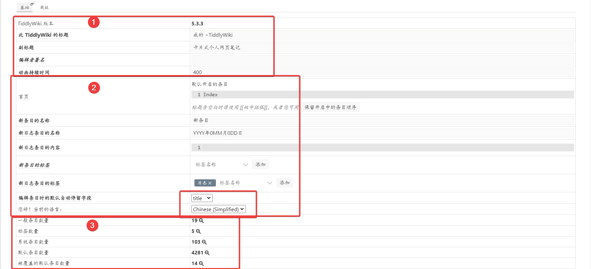

这里我是从网址上截图的，所以版本号跟太记本地的版本号不一样。把基本分成了三个部分。下面就从三个部分开始介绍。

### 基本设置

第一个部分基本上就是自己设置，编辑。比如标题与副标题，设置了就会在旁边展示。这里我设置跟本文档一样的标题好了。编辑者署名，这里可以新建一个条目，来保存。比如我通常署名`马不前`，然后新建一个条目，标题为马不前。在条目展示的时候，就会显示这个编辑者的链接。动画持续时间，我通常是设置为 0，感觉这样会快一点。默认 400 总感觉卡顿。当然设置成 400 是为了加载时一个缓冲。但设置成 0 也挺好。

### 编辑设置

第二个部分则是会对编辑产生影响的。比如首页开启条目。这里设置的是 index，但依据我个人的习惯会把这个条目删除，然后改成 TableOfContents。当然你也可以点击下面保留开启条目按钮。这样首页中展示的就是每次在故事河中展示的内容了。新条目的名称，是每次新建条目时，默认的条目名称是什么。这里我修改成`笔记`，这样每次新建条目，就会是`笔记 1`这种格式了。日志标题格式则看自己喜好了。一般默认的就行。下面两个标签设置，也是给新建条目时，会附带上的标签。比如新建日志条目，就会自动添加上日志标签。而且日志条目内容也可以预先设置一定的模板。

下面一个小方框中圈起来的，一个是编辑时停留的位置。可以修改成正文，也可以修改成标签。这样新建条目时，就会自动把光标停留在正文或者标签里了。另一个语言设置。这里太记模板是自带了语言插件，所以展示的中文。而默认的则是英文，可以在这里切换。

### 简单统计

第三个则是自带的统计。可以查看一些数据。比如一般条目数量，标签条目数量等等。点击旁边的筛选器会自动跳转到搜索框中展示。

## 外观

外观是修改 tiddlywiki 样式非常重要的一部分。这里对重要的内容进行介绍。

### 调色版

太记模板默认的主题是 itonnote，而这个主题默认的样式是 notion。notion 这个样式确实挺好看，但你也可以试试其他的样式，看看有没有满意的。下面会显示可以编辑样式。确实，你可以选择一个样式之后，进行编辑。但不建议这样做。因为要搞一个统一的样式是很难的，除非你有技术背景，不然调整起来可够累的。如果你一定要编辑一个自己的样式，那你最好是复制一个条目再在这个复制的条目上进行编辑。一些插件还会提供切换白天与黑夜样式的按钮。这个等具体到插件上再论述。

这里说声抱歉，我个人是更喜欢 SolarizedLight 这个配色主题的。但我发现自己修改后，与文档框架整体的白色色调不太搭。所以后面我又改成了 notion 的白色配色。但下面的截图，就不再重新截图修改了。

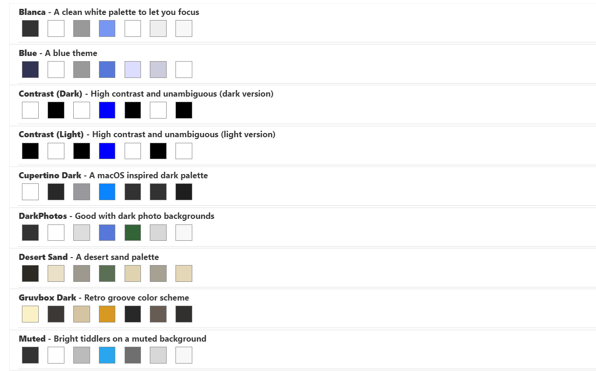

### 工具栏

工具栏这里就一个个看吧。这一部分非常重要，经常会在这里进行调整按钮。至于这些按钮的功能和作用，则在按钮那一节会展示。并且很多插件会增加按钮在这些工具栏上，可以在这里隐去。这里我为了能在一张图中展示所有按钮，稍微修改了一下，但内容实际上是一样的。

#### 编辑器工具栏

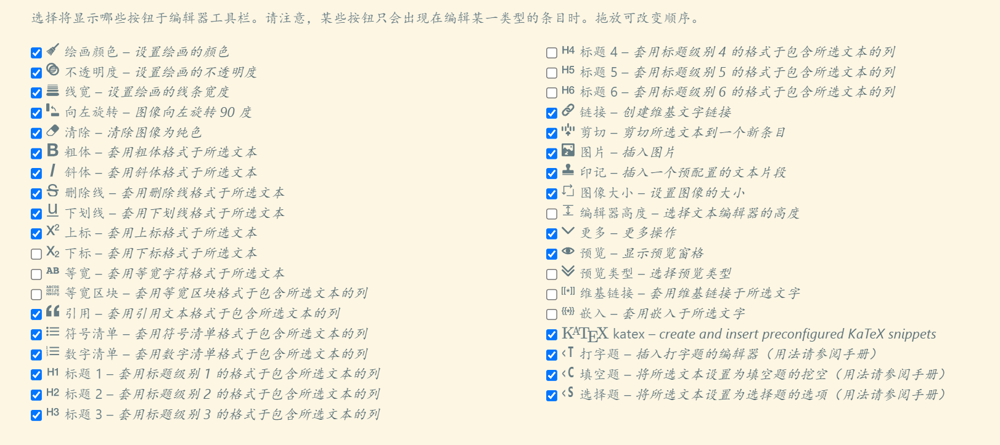

这里就是条目编辑时上面一排按钮了。只有勾选的按钮会展示出来。没有勾选的按钮就不会展示。而这些按钮背后也都是一个个系统条目，都具有`$:/tags/EditorToolbar`系统标签。并且这些按钮也是**拖放排序**的，你可以拖放成你想要的状态。这里我也按照我的喜好进行更改。

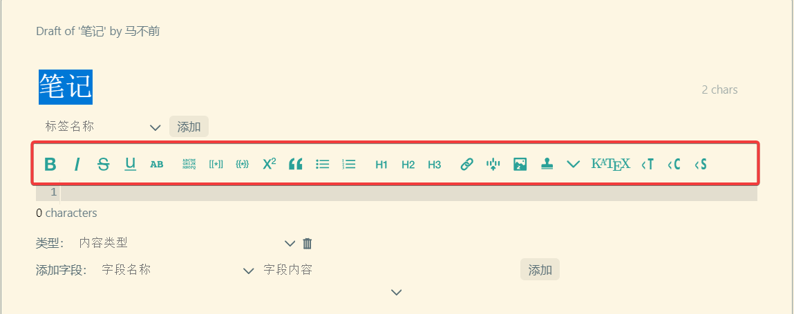

#### 编辑工具栏

这里的按钮是指页面上的编辑按钮。这些编辑按钮是带有`$:/tags/EditToolbar`系统标签的。也就是编辑完了之后，是选择保存更改，还是放弃更改和删除条目，这三个操作。

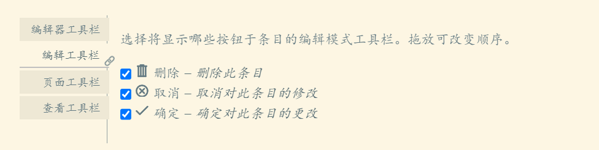

#### 页面工具栏

这里使用到的系统标签是`$:/tags/PageControls`，这些按钮是侧边栏主要功能性按钮。这里我也按照个人的喜好进行更改。

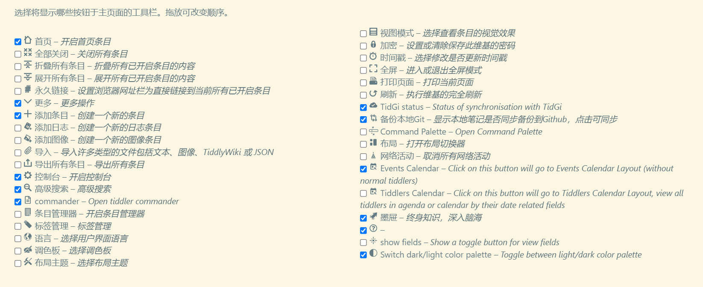

而没有勾选的，则会在更多这个按钮里点击后展示。你可以再点击下面的按钮来实现你想要的功能。

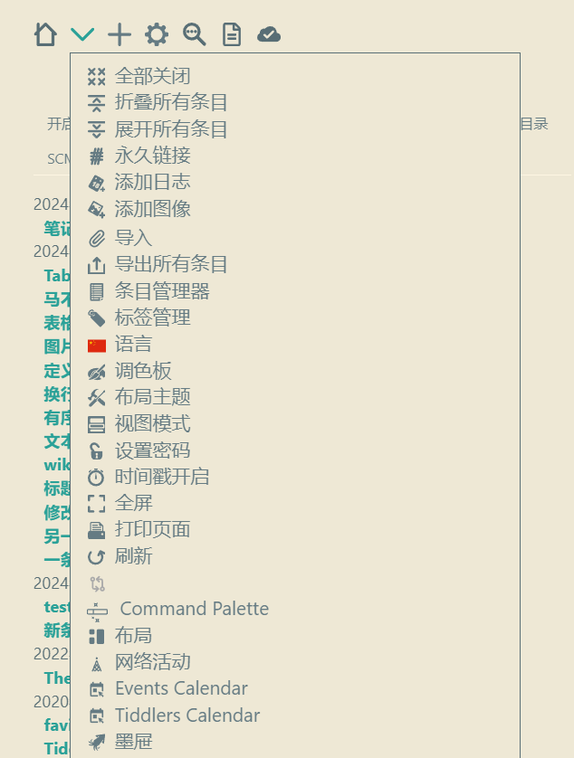

#### 查看工具栏

这里使用到的系统标签是`$:/tags/ViewToolbar`，这些按钮是条目上展示出来的按钮。这里我也按照个人的喜好进行更改。而没有勾选的，则会在更多这个按钮里点击后展示。你可以再点击下面的按钮来实现你想要的功能。

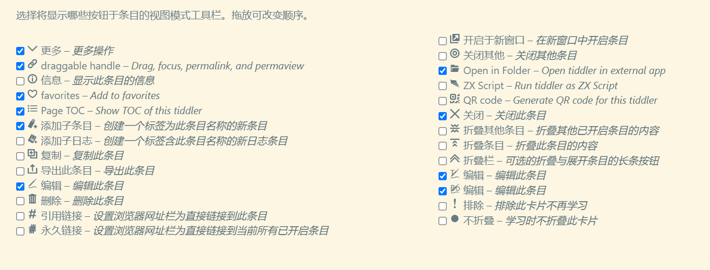

### 主题调整

#### 侧边栏布局与背景图像

侧边栏布局推荐，浮动故事，固定侧边栏。标题置顶这个是对于一些很长的条目来说，可以选择标题置顶，就会一直固定在上面。代码区换行，是对于很长的一段代码，是否会换行展示。

下面两个则是字体设置和背景图像设置。字体设置会另外单独讨论，这里就不过多阐述，太记模板默认带了一个英文代码字体。背景图像我一般不设置，有需要的可以设置一下。网站示例中[Read the Word,Read the World.](/site/jerry.html)和[凡尘芥之便条箱](/site/fcjz.html)就是给自己的网站添加了背景图像。你可以去查看他们是如何设置的。

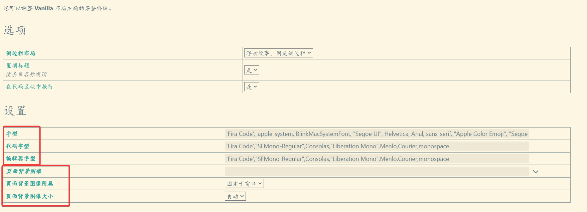

#### 字体大小

第二部分则主要是对字体大小的修改。这里你可以自己尝试看看，调整到一个相对合适的大小。或者也可以去发布网址中查看设置大小。这里要注意的是，修改大小要迅速，不然你把 14px 改成 18px 时，先删除 4，然后一下子就成了 1px，这就很麻烦了。所以你可以先全部把 14px 删除，然后迅速填入 18px。

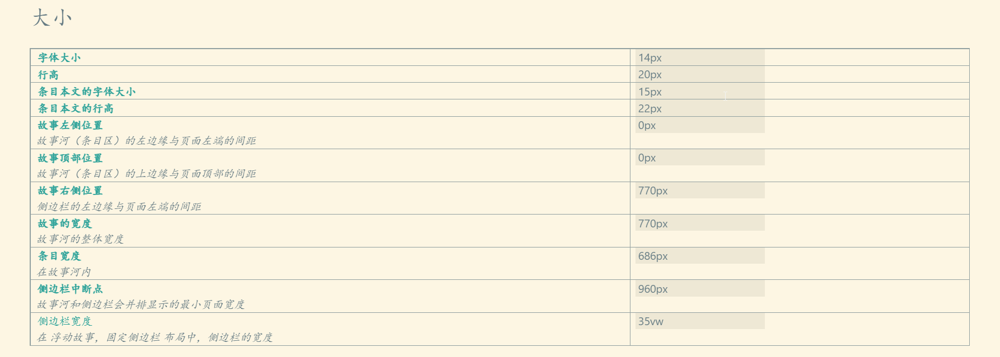

### 其他内容

#### 视图模式

视图模式没有太多要介绍的，因为 class 和 pop 都差不多，基本上是故事河的样式。而 zoomin，则是单个条目展示。打开了新的条目，就会关闭当前条目。一些插件会额外添加其他视图模式，这个会在插件中介绍。

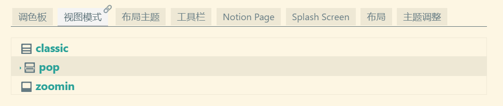

#### 布局主题

这里太记模板配套了一个主题。主要是样式上的变化，与原版的相差不大。但在下节版式中，我们会讲到另一种常见主题 notebook 主题。

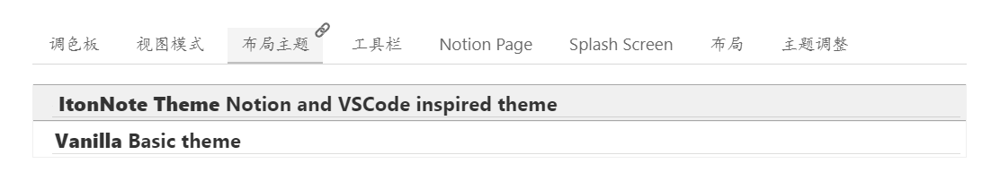

#### 布局

这里的布局是指对整个页面进行布局。部分插件使用这个布局方式进入到特殊编辑形态中。

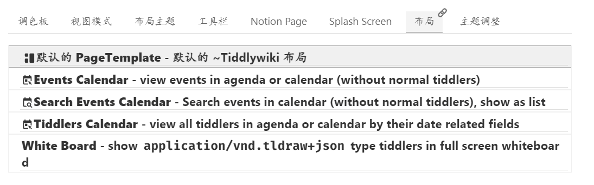

下图是进入日历插件中编辑形态。

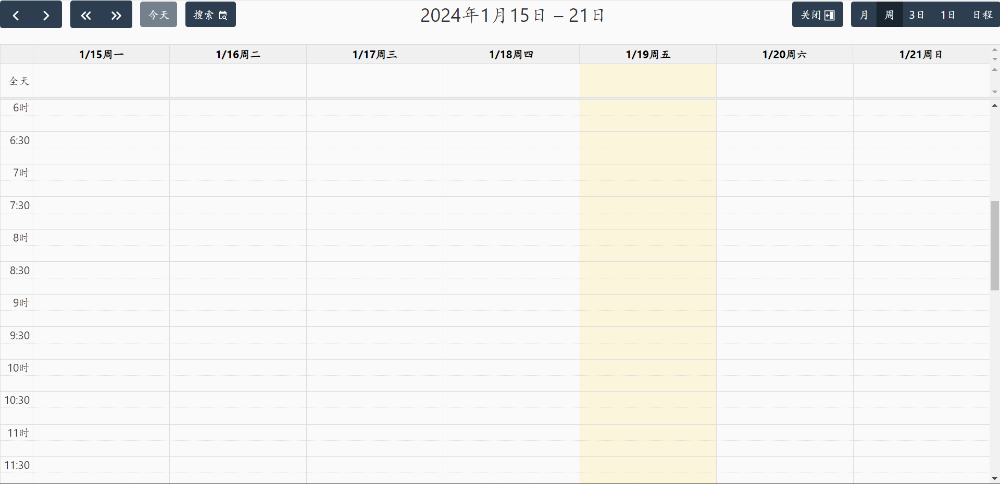

下图是进入白板插件中编辑形态。

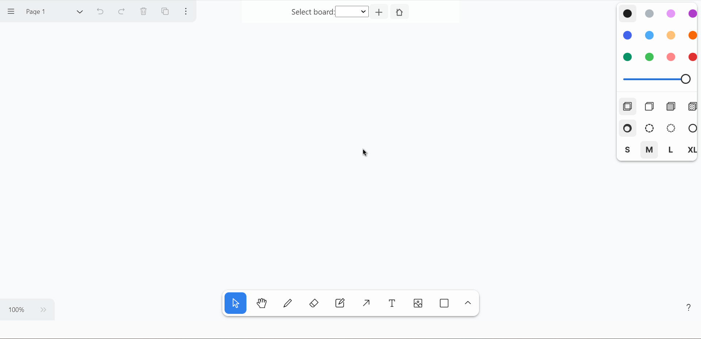

#### notion 与 xp

一些插件也会添加相应的设置放在这里。这里就以太记模板自带的两个插件中为例开始介绍。

##### notion page

这是由 notionpage 这个插件提供的，可以在条目中添加图标和背景图片，达到跟 notion 一样的效果。具体下面是一些设置图片大小。我个人是几乎不用这个插件的，因为图标和背景图片会影响加载性能。特别是如果给一个条目搞了，就会想着给其他条目也要设置图片。从而感觉好麻烦。但感兴趣的可以试一试。

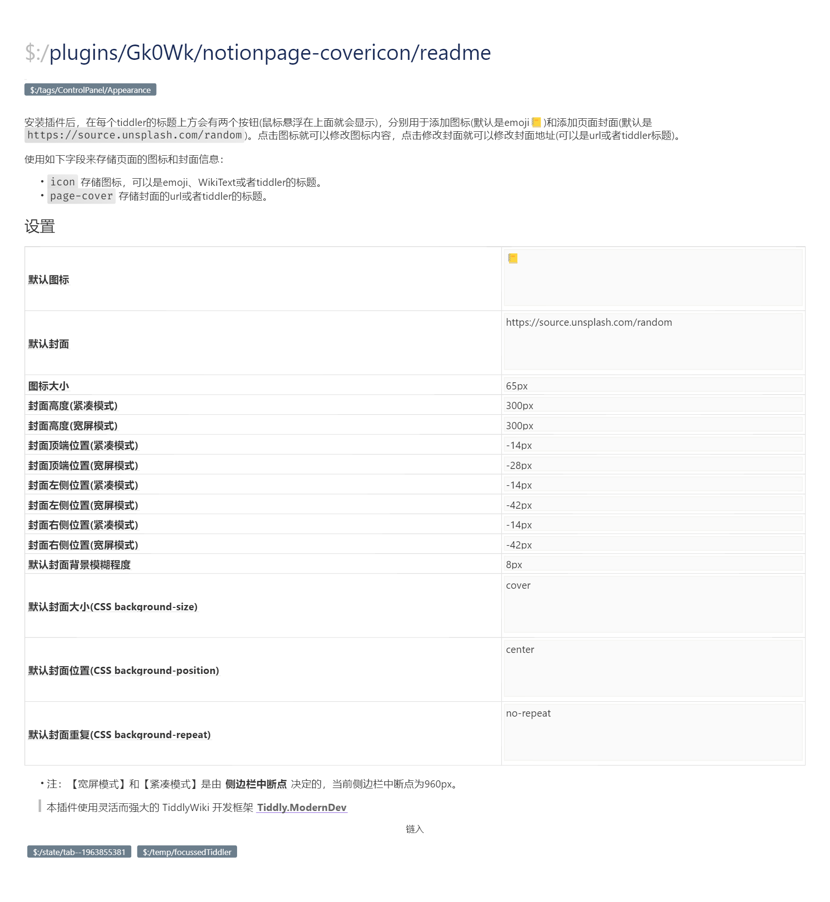

##### Splash Screen

这个是由 xp 插件提供的启动画面展示。你可以在下面中选择其他的样式。也可以自己新建一个样式。

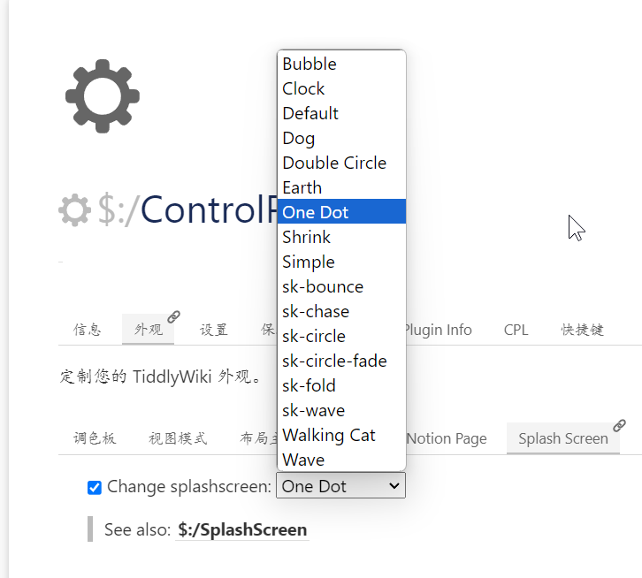

## 设置

这里是 tiddlywiki 和插件主要设置区域。可以从下图中看到有很多插件的设置。这些都会在插件中介绍。而 tiddlywiki 的自身的设置，这里我直接查看下图说明，具体都写明了，懒得一张张截图了。可以右键在新标签页打开图片，然后放大查看。也可以保存图片后，放大查看。

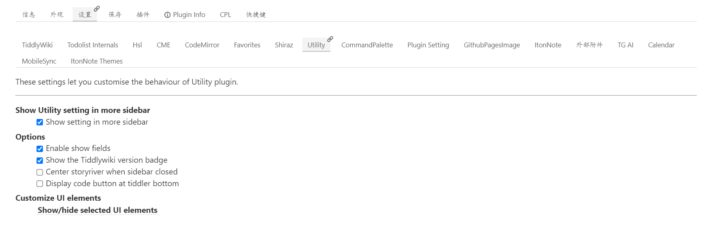

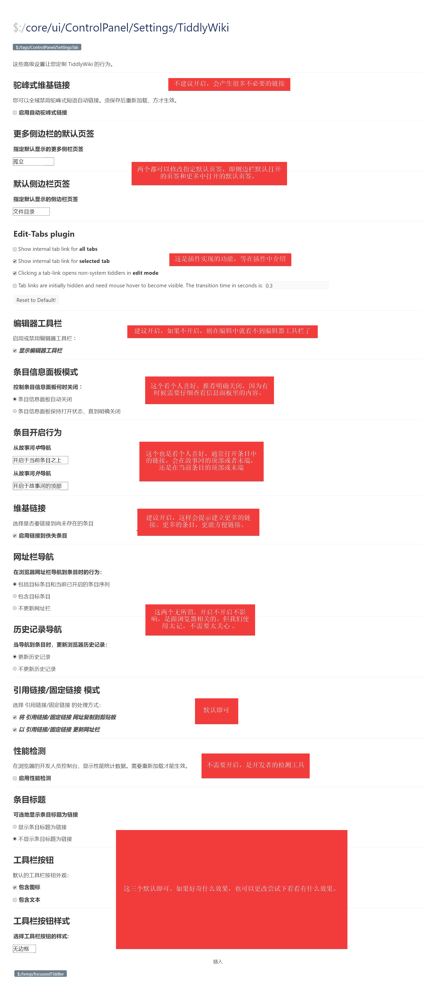

:::tip 驼峰式链接简要介绍
驼峰式链接(CamelCase Links)是一种在环境中链接词汇的约定,通常用于编程语言和格式。

它的特点是:

- 单词首字母大写
- 没有空格或符号,单词直接连在一起

例如常见的编程语言和格式:

- JavaScript
- Markdown
- XMLHttpRequest

这样的风格可以在不使用空格或连接符的情况下清晰地链接词组。
这比使用带空格和符号的自然语言链接更简洁,也更利于在编程语言和格式中表示。
所以,驼峰命名法通过单词首字母大写,移除分割符,可以产生更简洁和规范的联接词汇表示,常用于标识符和链接中。
:::

## 保存

这里是单文件保存方式。但因为我们直接使用太记作为保存方式，所以就不介绍这个了。主要是这个搞起来也非常麻烦。

## 插件

这里是插件部分的内容。如果安装插件请看[插件介绍](/plugins/description.html)。

## 快捷键

快捷键是由 tiddlywiki 和插件共同设置的全局快捷键。你可以在重新编辑快捷键，也可以选择在不同平台中使用不同的快捷键。

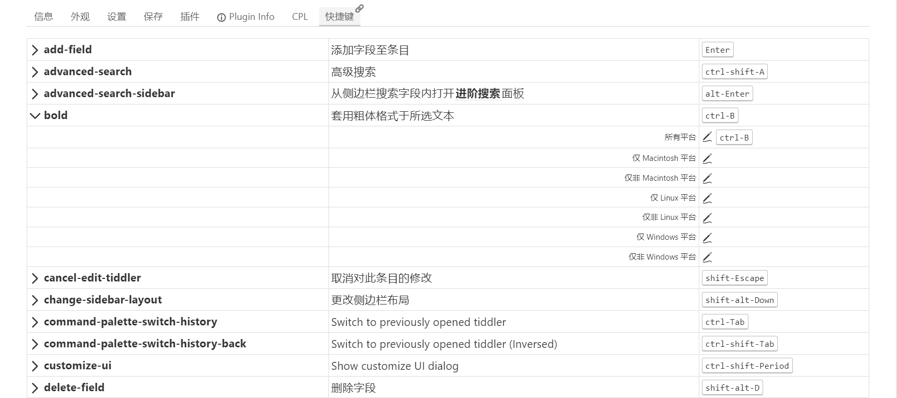
