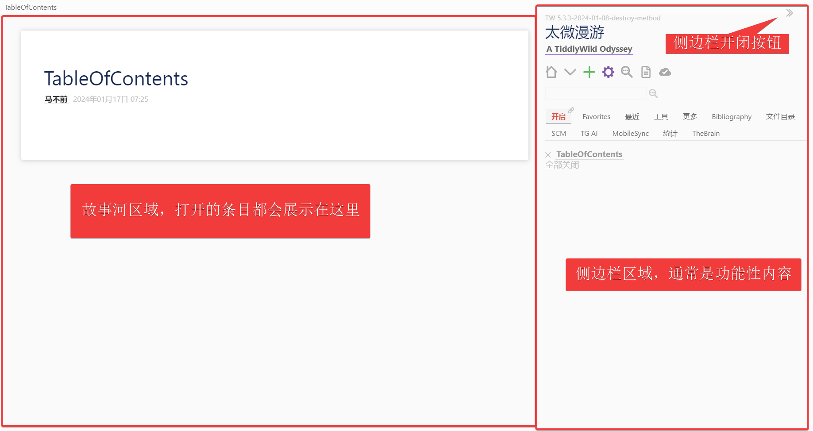
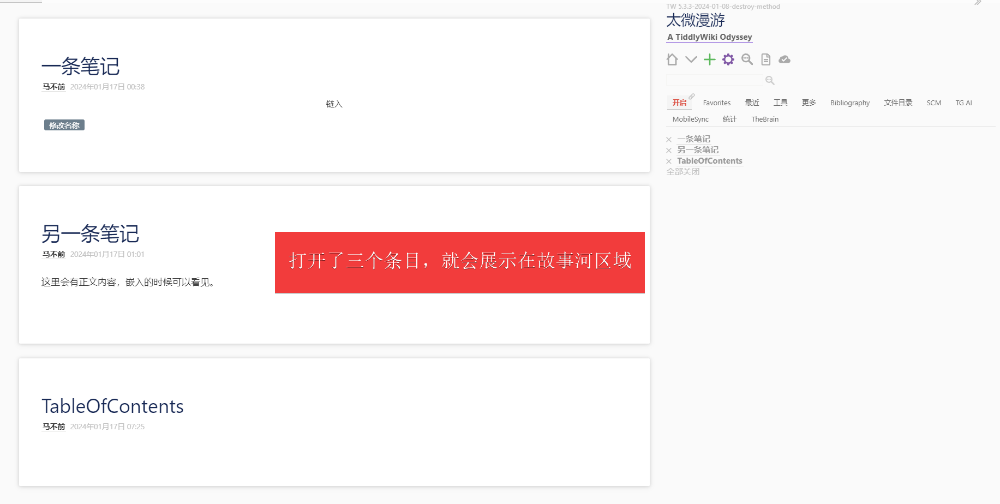
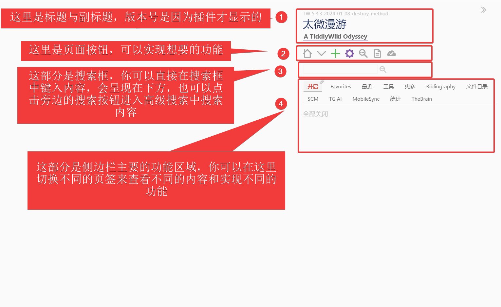
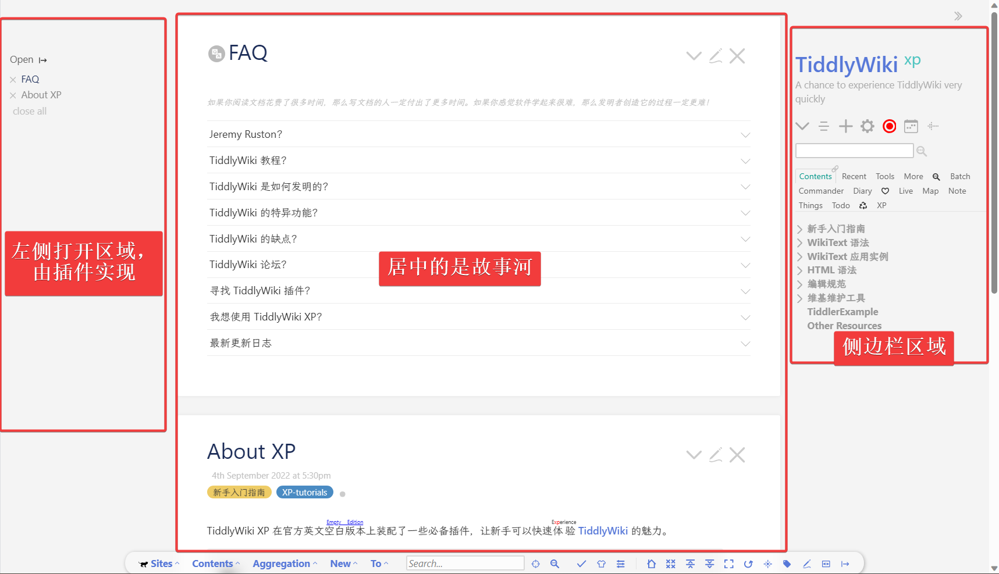

# 版式

## 默认版式

默认版式是左边故事河，右边侧边栏。侧边栏的顶部有一个按钮，可以用来开闭侧边栏。

### 故事河

故事河不太好理解，你可以把它当作是展示条目的桌面。正常来说，每打开一个条目，都会在下一个条目中展示。这个设计更像是浏览器的网页。

### 侧边栏

第四部分是通过系统标签`$:/tags/SideBar`来控制的。如果一个条目添加了这个系统标签，也会一并展示在侧边栏中。其他内容直接查看下图即可。

## xp 左中右版式

xp 在增加了`$:/plugins/xp/leftopentab`插件后，把打开放在了左右，更方便查看内容。

## notebook 版式

暂定。因为这个插件仓库出了问题，暂时访问不到了。

## 其他版式

暂定。在主题插件那边详细介绍吧。
