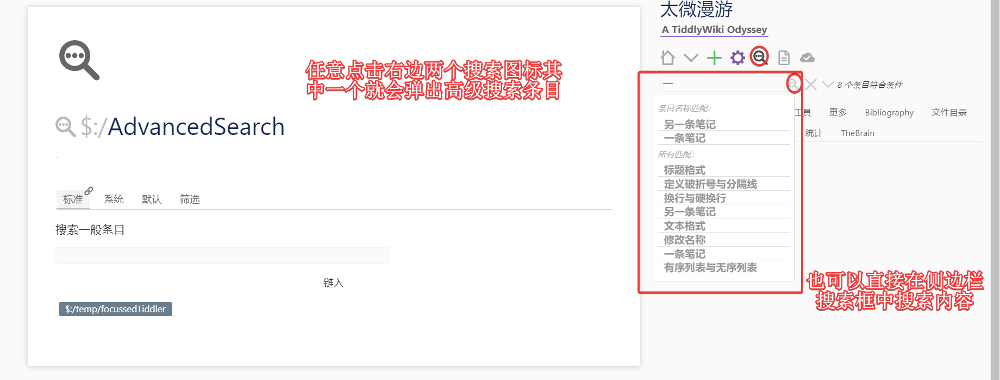
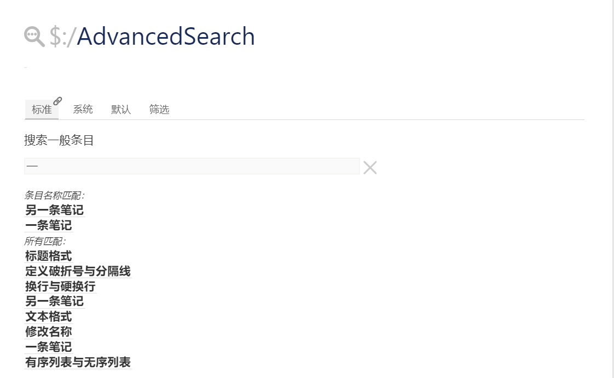
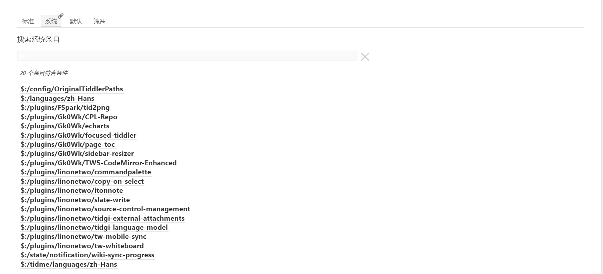
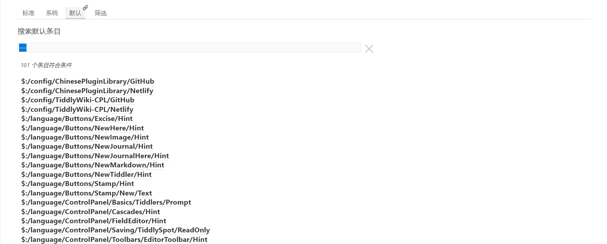
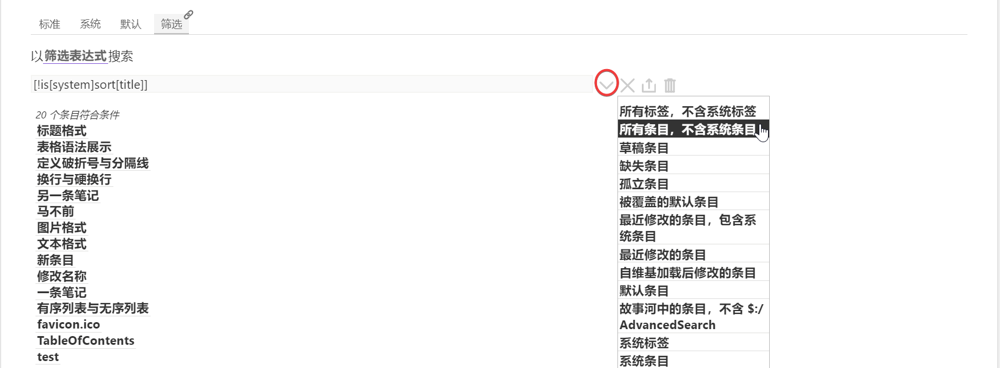
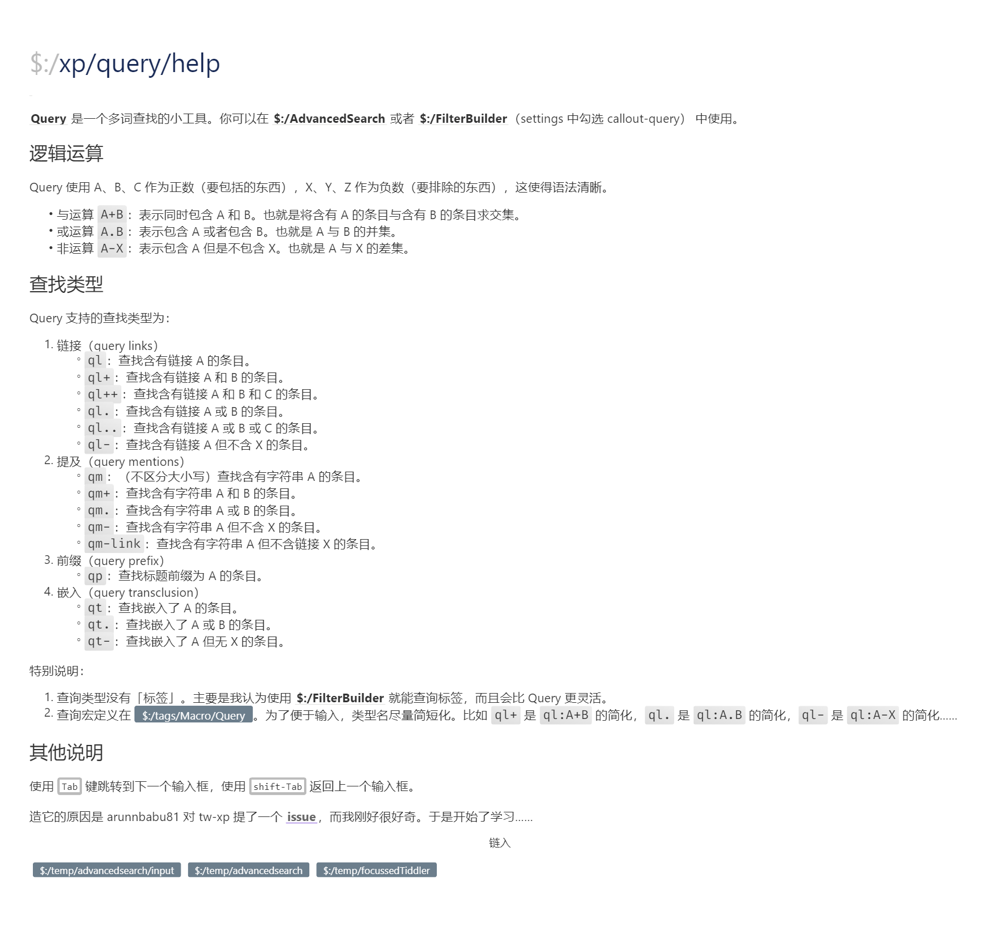

# 搜索

tiddlywiki 内置搜索功能。你可以在侧边栏发现有两个搜索图标。一个是放在一排按钮里的，另一个是单独和一个输入框放在一起的。那是一个简易的搜索输入框。你可以键入内容，进行搜索，在下面展示的条目中，点击会跳转过去。

点击搜索图标会在故事河中打开高级搜索条目。默认有四个，标准，高级，默认和筛选。这些其实是四个系统条目，都带有`$:/tags/AdvancedSearch`系统标签。

### 最小搜索字符限制

tiddlywiki 为了性能考虑，设置了一个最小搜索字符限制，要求搜索字符大于三个字符。但对汉语来说，两个字符是很常见的。所以你可以修改系统条目`$:/config/Search/MinLength`为 2 或者 1，太记模板把这个改成了 1，如果不是使用太记模板的，注意修改一下。

### 标准搜索

标签搜索和侧边栏搜索框中展示的内容是一样的。可以从图片中看到，标准搜索分成两部分，一部分是匹配标题的条目，另一部分则是对正文和字段内容都有匹配的条目。

### 系统搜索

系统搜索展示出来的内容都是系统条目，通常是插件条目和系统标签等。你可以从下面图片中看到，尽管搜索内容是`一`，但展示出来的还是系统条目。

### 默认搜索

默认搜索展示出来的还是系统条目。但和系统搜索不一样的是，这里展示的其实是影子条目。

在 tiddlywiki 中，一个插件通常是众多系统条目的集合。而这些系统条目里面也会包含一些可以供用户设置的内容。用户可以修改其中的系统条目，tiddlywiki 就会生成一个新的系统条目出来，覆盖掉原来插件中设置的条目。这样 tiddlywiki 就会优先使用用户修改后的设置了，而不会继续使用插件中的设置。但在导出插件时，导出的仍然是插件的设置，而非用户设置后的了。这是为了可以让插件在不同 wiki 中实现其原本的功能。不然用户 A 还要告诉用户 B 自己修改了什么条目，以及如何改回来。这太麻烦了。

这一功能是通过 tiddlywiki 的影子机制实现的。即插件里包含的众多条目实际上是影子条目。而当这些影子条目被修改时，影子条目就不再生效。所以你可以看到下面截图中，展示的实际上是插件里的影子条目。

### 筛选搜索

筛选搜索是通过筛选表达器进行搜索的。筛选表达器会在下一章节内容里讲述，这里就简单从图片中介绍。

在搜索框中，有一个下拉的图标。点击下拉的图标，就会展示系统预定的一些筛选器。这里点击的是筛选 wiki 中所有非系统条目。然后就会自动填入`[!is[system]sort[title]]`这一筛选器表达式到输入框中。从而就能看到下面的搜索内容。你也可以试着点击其他内容，查看对应的筛选器表达式是什么，和相应的筛选结果是什么。

搜索框中另外两个图标，一个是导出筛选器中筛选的条目意思。另一个则是删除所有筛选出来的条目。这些会在下一章节批量修改中阐述。

如果是和之前一样，填入`一`搜索字符，那就会显示一个缺失链接条目。因为这实际上是`[[一]]`或者`[title[一]]`的简写形式。这里会默认传递这个筛选器，进而会得到一个缺失链接条目。如果有这个`一`条目，就会展示出这个条目来。

### Query 搜索

在 tiddlywiki 中，还可以通过插件来实现各种各样的搜索查找。甚至你也可以自己写一个搜索查找的小工具来实现想要的功能。这里不过多展开，只介绍两个。一个是 xp 插件中另一种搜索查找方式，query 搜索查找。

太记模板没有安装`$:/plugins/xp/aggregation`插件，你需要安装这个插件才能实现这个功能。query 使用方式，你可以搜索`$:/xp/query/help`条目进行查看，下图即是这个条目。

