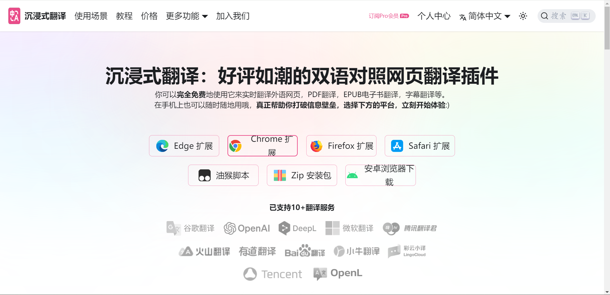
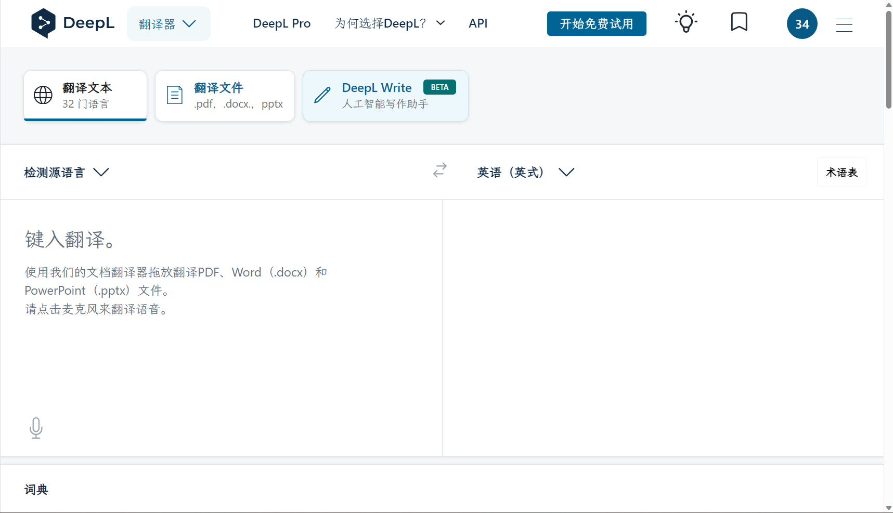
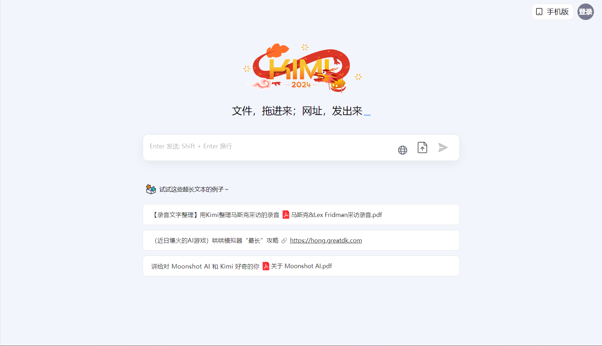

# 英语与翻译

英语好的话，对学习太微是非常有帮助的。因为太微本身比较小众，很多文档都没有中文翻译的。特别是插件这块，基本上没有翻译。而要持续保持跟进翻译，很费时间。除了有爱好者发电外，基本上很难等到翻译好的成果。所以最好的办法就是**自己英语好，自己能看懂**。但很明显，我自己英语也不好。所以就提供一些其他方式。

## 浏览器翻译

Edge 浏览器和谷歌浏览器，都是有自带翻译成中文的功能的。

:::tip 如何使用浏览器自带的翻译功能

浏览器自带的网页翻译功能可以很方便地翻译网页内容,使用方法如下:

1. 打开需要翻译的网页,比如英文网页。
2. 点击浏览器的右键,选择“翻译到中文”(Chrome 浏览器)或“以中文显示”(Edge 浏览器)。
3. 浏览器会在一个新标签页中展示翻译后的中文网页。
4. 你也可以选择只翻译部分内容:先选择要翻译的文字,右键选择翻译。
5. 在 Chrome 中,也可以通过点击地址栏右侧的翻译按钮来快速翻译当前页面。
6. 可以在浏览器的设置中调整翻译引擎和语言对,以获取更好的翻译质量。
7. 部分浏览器还支持网页单词查词、句子翻译等功能。

所以浏览器翻译功能可以让你用母语浏览世界,很值得利用。需要翻译时直接使用浏览器提供的翻译即可,无需额外安装翻译扩展程序。

:::

## 沉浸式翻译插件

- Site: https://immersivetranslate.com/
- Code: https://github.com/immersive-translate/immersive-translate/

如果你觉得浏览器自带的翻译功能不够完善，那么你也可以使用沉浸式翻译插件。上面的 github 仓库并不包含源代码，里面只会上传最新版本和收集用户反馈。我个人是很早就开始使用了，虽然没有开会员，但基本上也够使用。有时候需要翻译 pdf 文件，也是直接用这个来翻译的。总之，功能很强大。

## Deepl

- Site: https://www.deepl.com/translator

上面的沉浸式翻译还可以在开启会员后使用 deepl 和 gpt 的翻译。deepl 也非常好用。我主要是用来跟国外论坛用户交流时，我先写中文，然后让 deepl 翻译，看得差不多，能表达出自己的想法，就复制过去。一般来说，使用额度肯定是够用的。

## KiMi AI

- Site: https://kimi.moonshot.cn/

如果上面几款工具还是不能满足你，那你还可以试一试 AI 工具。而 AI 工具，目前应该来说是比较普遍了。至少翻译个内容，应该不至于太困难。这里我也推荐一个国内用户可以正常访问使用，功能强大的 AI 网站。网址就在上方。同样可以用来翻译，用来询问各种问题。林一二在搞一个专门用来处理太微的 AI 工具，目前在收集素材阶段。未来或许就可以用上专门的太微 AI 了。

