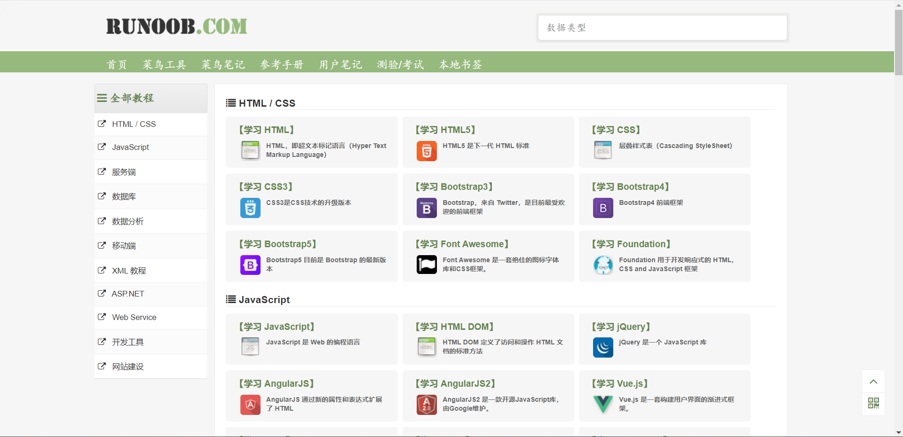
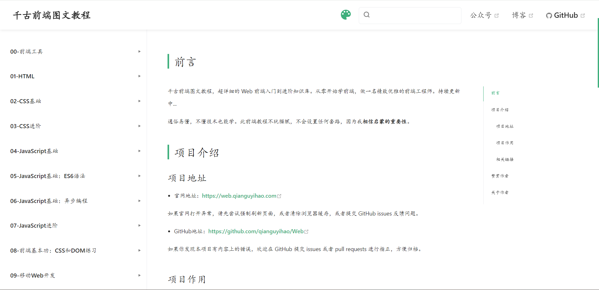
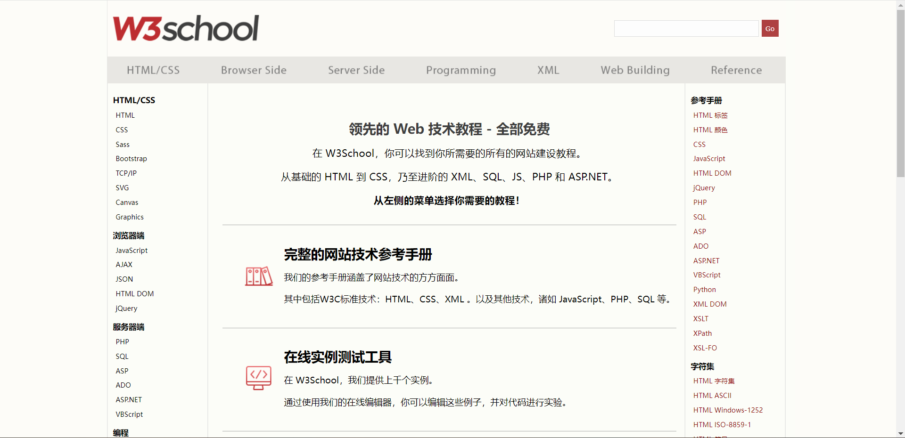
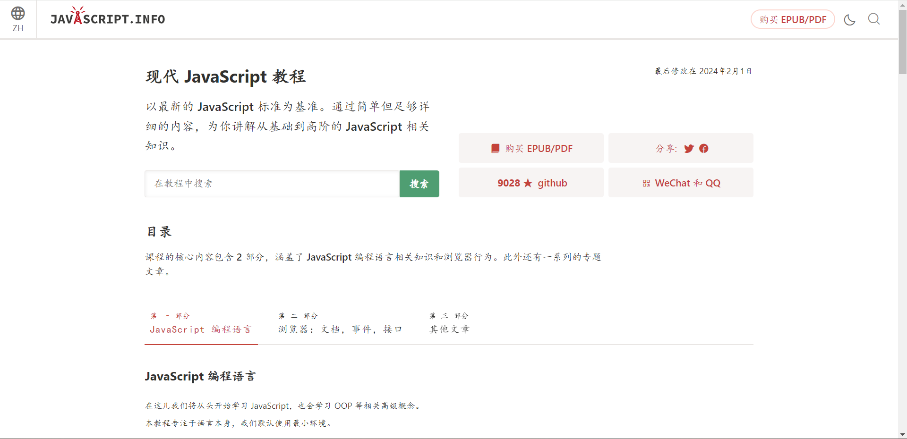
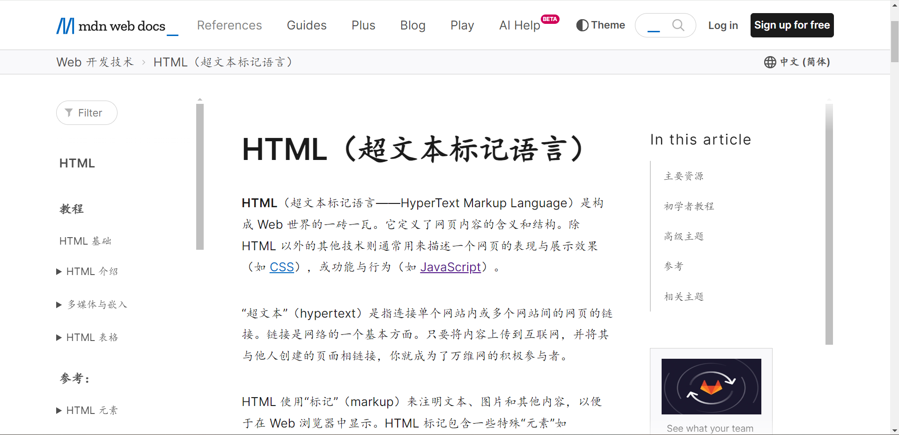

# 前端三件套

太微实际上就是一个单页面的 HTML 程序，但对于一些新手来说，对 html 也可能不熟悉。至少我在接触太微之前，对 html 和 css 之类的完全不了解。后来才知道这是所谓的前端三件套。而了解 html 和 css 以及 js，如果有能力掌握 js 的话，对使用太微非常有帮助。所以这里也列举一些相应的教程文档资源，方便各位查找学习。实际上这些技能掌握了，对使用其他软件也非常有帮助的。这里只列举一些文档资源。视频资源可自行搜索查找，几乎任何平台上面都有。

## 菜鸟教程

- Site: https://www.runoob.com/

## 千古前端图文教程

- Site: https://web.qianguyihao.com/
- Code: https://github.com/qianguyihao/web

## w3school

- Site: https://www.w3school.com.cn/

## 现代 JavaScript 教程

- Site: https://zh.javascript.info/
- Code: https://github.com/javascript-tutorial/zh.javascript.info/tree/master

专注于 JS，如果能掌握 JS 的话，那么使用太微就更容易了，而且更能发挥其背后的价值。

## MDN 教程

- Site: https://developer.mozilla.org/zh-CN/docs/Web/HTML

这算是比较权威的教程文档了。通常适合查找了解。
