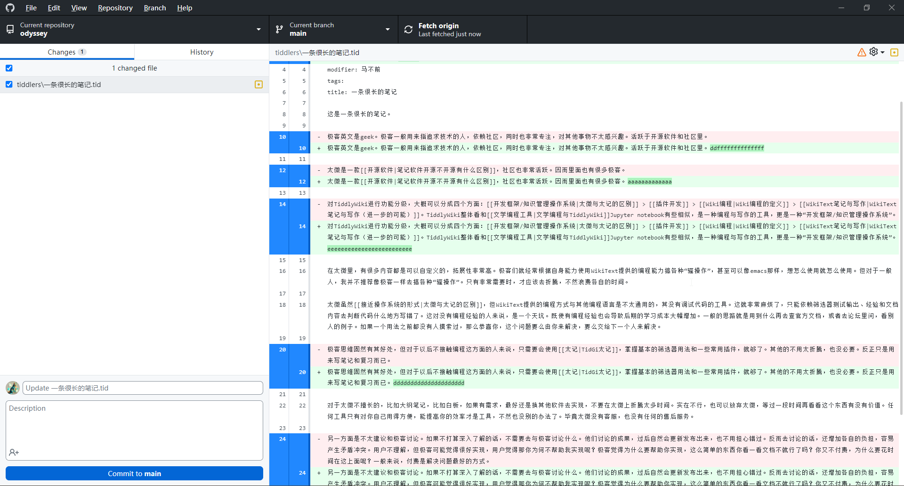
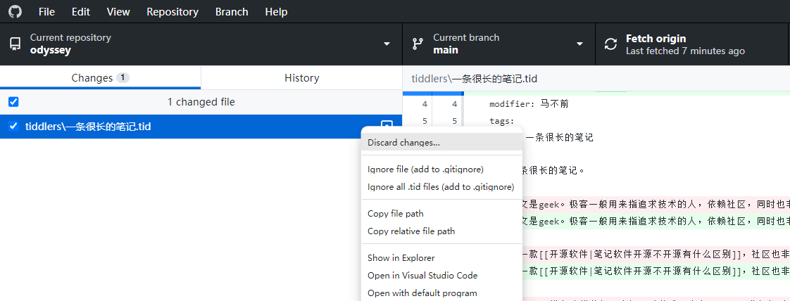
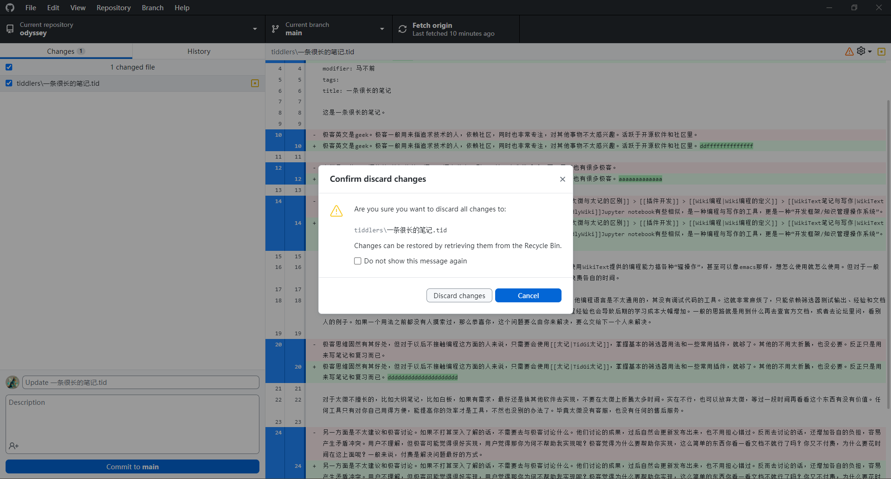
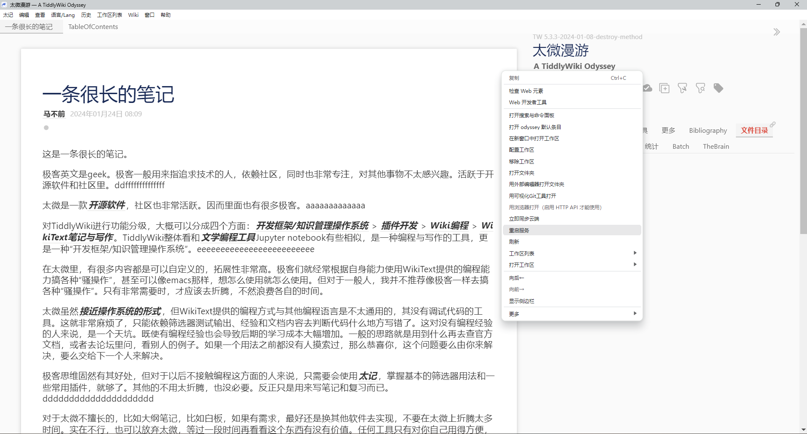
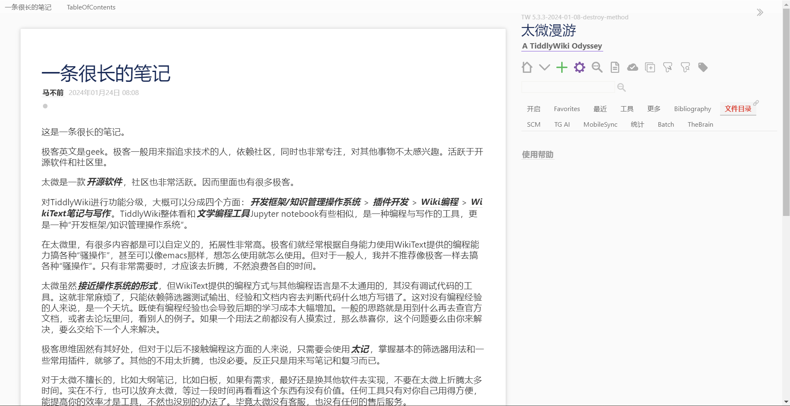
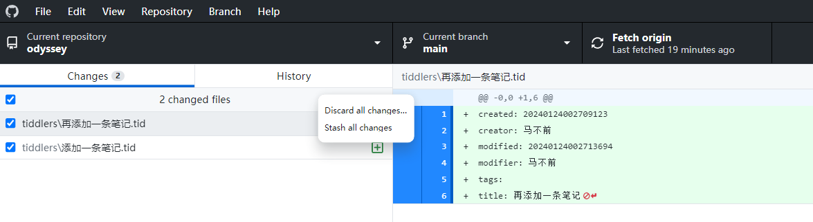

# Github Desktop

这里主要是展示一下 Github Desktop 在使用太记过程中的两个重要功能。同步功能之前的篇章已经论述了。这里再论述两个功能。

## 清空 changes

这里主要在使用太记中，编写了一些条目，或者修改了一些条目。但后面想回到原来之前的样子。可以通过 github desktop 来进行清空改变。当然这背后都是在执行 git 相关命令，如果你对 git 命令熟悉，也可以直接使用 git 命令行操作。

上面图片中，我们在一条笔记中夹杂了很多英文字符。而当我们不需要这些英文字符时，我们可以用 github desktop 打开这个 wiki，然后在这个条目上方选择，discard changes，也即撤回改变。

点击之后会出现下面的弹窗。如果你要放弃修改的内容，就点 discard changes，如果你不想放弃修改的内容，就点取消。这个弹窗你也可以在下面勾选不再出现，这样下次你直接点 discard changes 时，就会直接执行这个命令操作。

点击完 discard changes 之后，你还需要回到 wiki 中，重启 wiki，不然条目还是会和之前的一样。

点击完重启服务后，太记会重新加载 wiki 文件夹内容。这样才能回退到之前修改的样式。

这样就去除了之前英文的修改了。

这是回退一个条目的操作。但在 tiddlywiki 中，我们经常会批量修改条目。所以这里也简单介绍下如何同时撤回多个条目。

图片中添加了两条笔记。然后点击上面那个 changed files，就会弹出 discard all changes 按钮了。注意这里不管勾选还是没有勾选，都是对所有文件执行 discard changes 操作。

## 回滚 history
