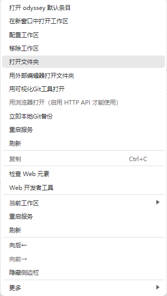
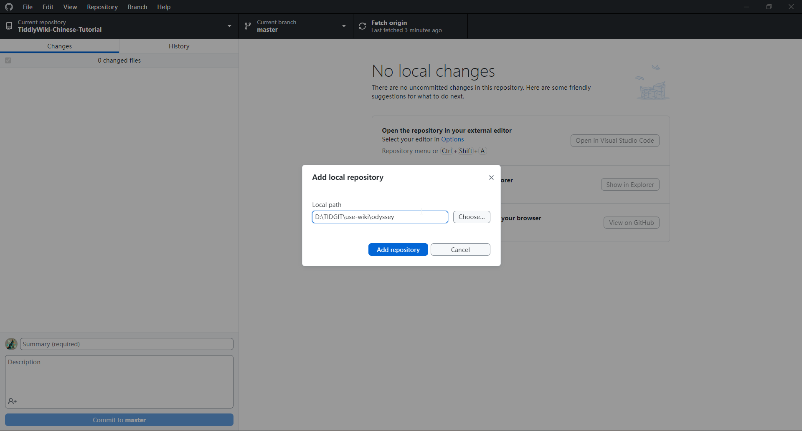
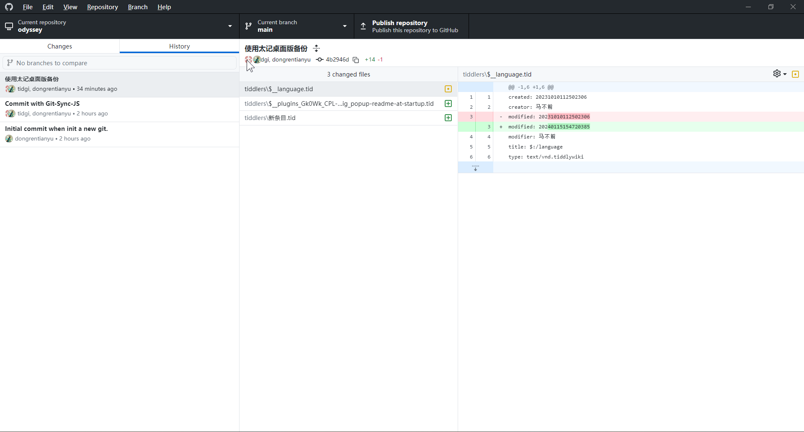
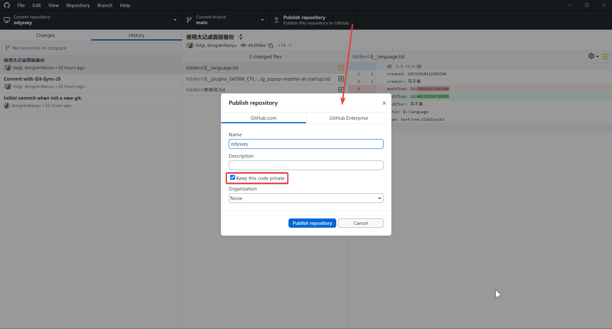
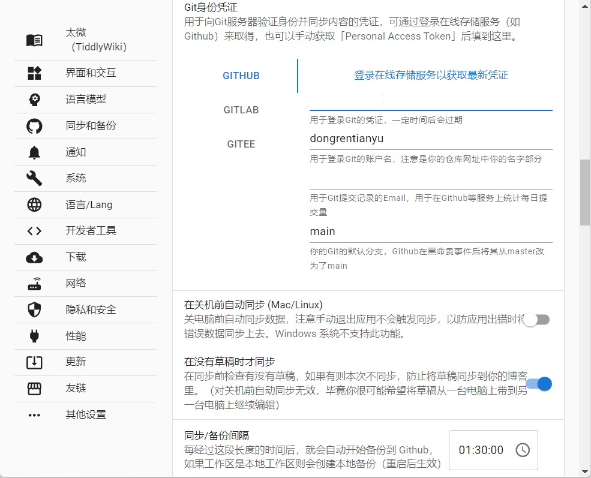
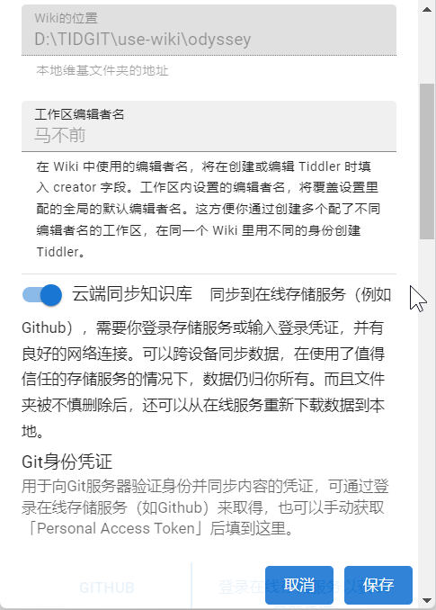
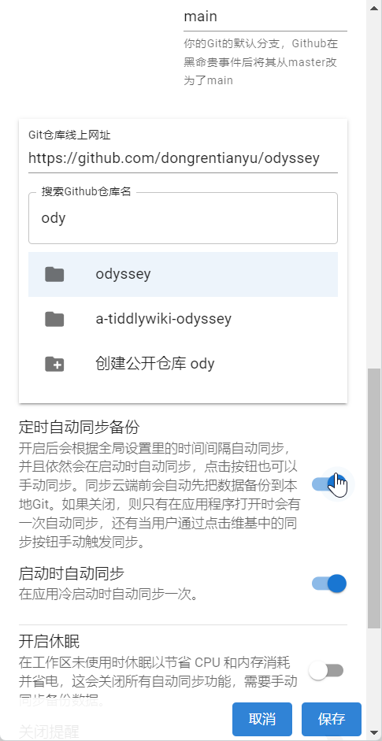

# 同步太记

## git 和本地 git 同步

首先太记是一个完全可以本地使用的软件。同时也带有本地 git 备份。而下面是 AI 关于 git 的介绍。

:::tip git 简要介绍
Git 是目前世界上最先进的分布式版本控制系统。

简单来说,Git 主要提供了以下功能:

1. 分布式版本管理 - 即每个人电脑上都是一个完整的版本库,方便协作开发。
2. 代码历史追踪 - 可追溯每一个版本的每一行代码的变动。
3. 支持多种工作流模式 - 如 GitFlow,GitLab flow 等流程管理开发、测试、发布。
4. 分支管理 - 可以方便地创建、合并分支。
5. 多种远程同步方案 - 支持 https/ssh 等多种同步协议,同步代码到远程仓库。
6. 权限控制 - 可以按标签分配访问权限给不同开发者。

总体而言,Git 大大提高了软件开发的协同效率,让开发人员可以更加专注于本身的开发工作,而无需过多担忧版本控制问题。它已经成为从小项目到大型系统开发过程中必不可少的工具。
:::

尽管 git 是给开发人员所使用的，但了解一下 git，对于普通人来说，也是非常有帮助的。而且使用 git 可以更有效地管理文件和文件不同版本。

在本地编辑完之后，可以选择右键本地 git 备份。这样太记就会自动提交一下 git。如果你没有手动点击 git 备份，太记则会按照同步间隔里设置的时间进行 git 提交。如果在设置区内关闭了自动同步，则不会进行同步。

当然如果你要查看 git，那么你需要在电脑上安装 git。这些本文档也不会阐述，只能是你自己去网络上搜索学习。放心，相关文章视频非常多，很容易就搜索了解到的。

## github 账号与 github desktop

:::tip GitHub 简要介绍
GitHub 是目前世界上最大的代码托管平台,它建立在 Git 的版本控制系统之上,主要提供以下功能:

1. 代码托管 - 可以创建公开或私有的软件代码仓库,基于 Git 进行版本控制。
2. 协作功能 - 通过 Pull Request、Issue、讨论等方式协助开发者在线协作开发。
3. 访问控制 - 可以对仓库、分支、Pull Request 等实体细粒度配置读写权限。
4. CI/CD 集成 - 提供 Actions 等功能,可以自定义工作流自动化测试、构建、部署。
5. 项目管理 - 提供 Projects、 Wiki、页面等功能管理项目。
6. 代码审查 - 通过 Code Owners、Commit 状态等管理提交审查。
7. 社交网络 - Follow 用户和 Repository,获取动态和推荐项目。

GitHub 已成为**开源社区的脊梁**,众多开源项目和公司内部项目都托管在 GitHub 上进行协作开发。它极大地降低了软件协作的门槛,推动了开源文化的繁荣。
:::

因为一些特殊原因，国内访问 github 有些困难。所以如果你不能保证很好地访问 github 的话，那就需要你自己去网络上搜索相关资料，如何加速访问 github。这方面的资料也是非常多的。

当然注册 github 是没有门槛的，用 QQ 账号就可以注册。

:::tip GitHub Desktop 简要介绍
GitHub Desktop 是 GitHub 官方推出的 Git 图形化客户端工具,主要功能包括:

1. 本地版本控制：初始化本地仓库,进行提交、分支、合并等操作。
2. 远程同步：连接远程 GitHub 仓库,拉取和推送提交。
3. 简化工作流：直观的图形界面,无需记命令就能完成主要的 Git 操作。
4. 冲突解决：可视化差异比较,更容易解决文件冲突。
5. 持久认证：记住 GitHub 用户认证信息,避免重复登录。
6. 自定义工具：支持 Shell 命令扩展、代理设置等自定义配置。
7. 跨平台使用：支持 Windows 和 MacOS 两个主流桌面平台。

总的来说,GitHub Desktop 大大简化了使用 Git 的复杂性,使得初学者和非命令行用户也能便捷地使用 Git 完成版本控制与协作,从而促进开源文化。它是 GitHub 生态系统的重要组成部分。
:::

github desktop 是非常推荐安装的。后续也是以 github desktop 为主。安装后登录你的 github 账号就可以。

安装好 github desktop 和登录账号后，右键 wiki，用可视化 git 工具打开。如果你没安装 github desktop，太记则会提醒你去安装。然后你就可以把本地的 git 仓库添加到 github desktop 里查看了。下面是两张演示图。

然后在右上方有一个按钮，点击可以推送到 github 去，也就是会把这个 git 仓库推送到 github。这样你的笔记就会备份到 github 里，只要 github 账号不出问题，就能一直作为备份网盘使用，容量是 5g，正常不放图片或大型 pdf 文件，是完全足够使用的。觉得不够使用的可以再开一个 wiki 仓库。这里默认是设置为私密仓库。但为了演示后续发布网址部分，我就选择了公开仓库。

## 获取 token 与填入 token

:::tip GitHub Token 简要介绍
GitHub Token 简单来说就是用于访问 GitHub API 的个人访问令牌。获取 GitHub Token 的方法如下:

1. 登录 GitHub,在右上角头像处点击 Settings
2. 在左边菜单中选择“Developer settings”
3. 选择“Personal access tokens”
4. 点击“Generate new token”
5. 填写 Token 描述,选择 Token 的授权范围(Permissions)
6. 点击底部“Generate token”按钮生成 Token
7. Token 生成后只显示一次,必须要复制保存

通过这些步骤你就可以获得一个新的 GitHub Personal Access Token。

这个 Token 可以 Authorized 身份访问 GitHub API,比如通过脚本自动创建 Issue、推送代码等。Token 权限可以精确配置。在使用 GitHub API 时,可以用 Token 代替密码,进行授权验证,这比直接使用密码更安全。一般将 Token 保存在环境变量或配置文件中,不要明文写在脚本里。
:::

这里说明两点。token 是**有期限的**，最长是一年时间，过期了需要重新申请或者延长。而且 token 的权限也可以设置成不一样的。但通常需要打开 read 和 write 权限，以保证向 github 仓库推送。

其次，**token 十分重要，只会出现一次，千万千万不要泄漏**。你可以复制到另一个 txt 文件夹里保存。因为 token 泄漏了，其他人就可以使用这个 token 控制你的 github 账号，对你的 github 仓库进行编辑，推送，下载等。如果泄漏了，一定要尽快更换 github 账号密码，必要时可更换 github 账号。

然后就是回到太记里，设置一下 token，同时添加其他信息。注意这里的邮箱要和 github 上面的账号邮箱保持一致。这是针对全局账号而言的。当然不同的仓库可以设置不同的账号提交，只是要和 github desktop 那边设置的一样才行。

登录在线服务那个按钮好像用不了。但也有可能 bug 修复了，也可以测试一下。

## 设置 wiki 为线上仓库

填好了 token 之后，太记就会自动保存下去了。然后还是右键 wiki，打开配置区，设置本地知识库为云端知识库，然后填入你的 github 仓库地址。然后可以选择是否开启自己同步备份，开启之后会依据全局里设置的时间进行自动同步备份。关闭后就只会在打开此 wiki 时进行同步启动。最后一点要**点击保存**，不然是无法把设置内容保存下来的。

|         开启云端同步         |          自动同步备份           |
| :--------------------------: | :-----------------------------: |
|  |  |

如果开启自动同步备份的话，在太记自动同步时，可能会因为网络问题而无法正常提交。然后就会使用带有 test 账号进行提交。这一点要注意。
