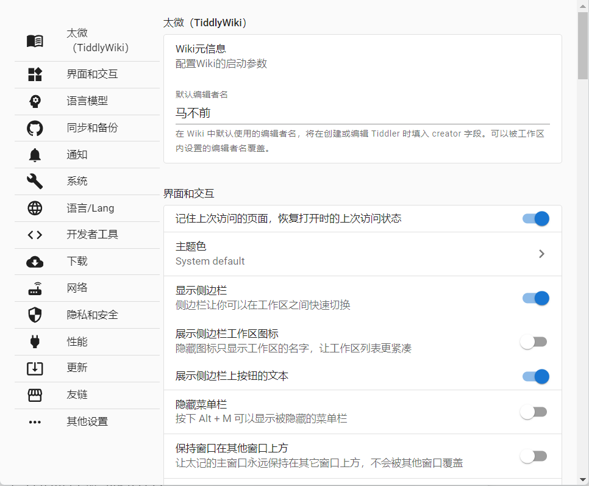
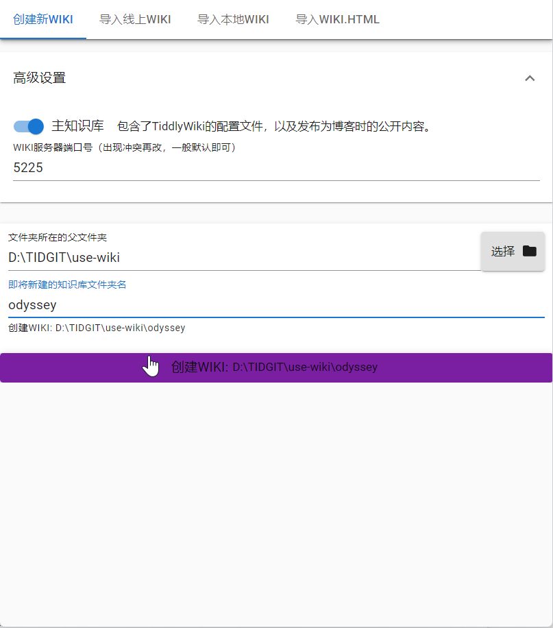
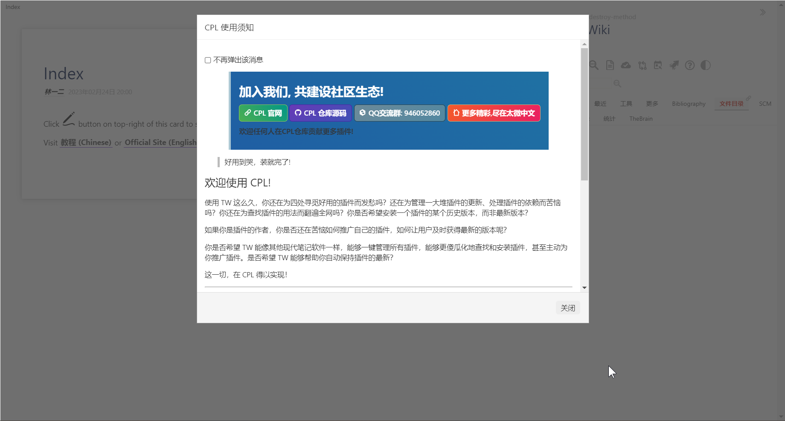
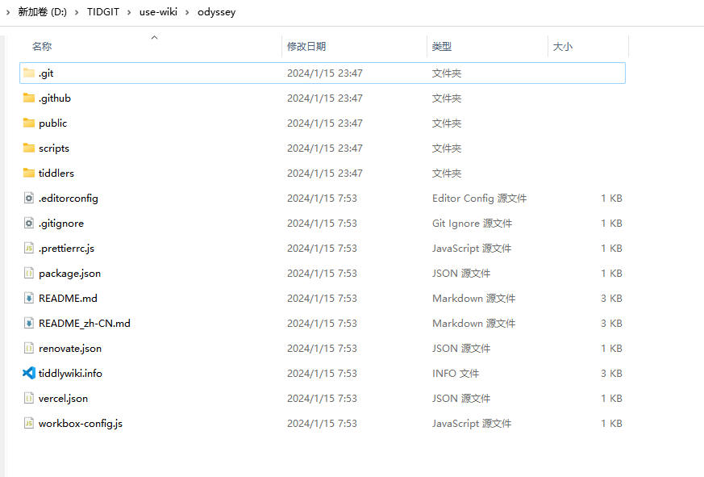
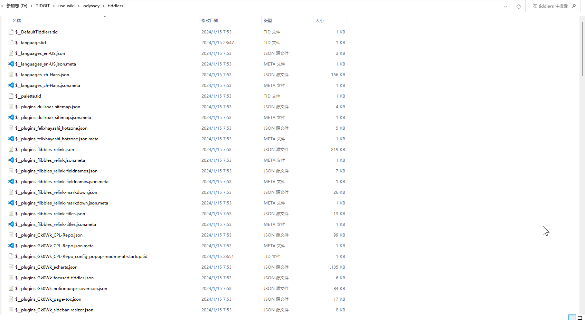
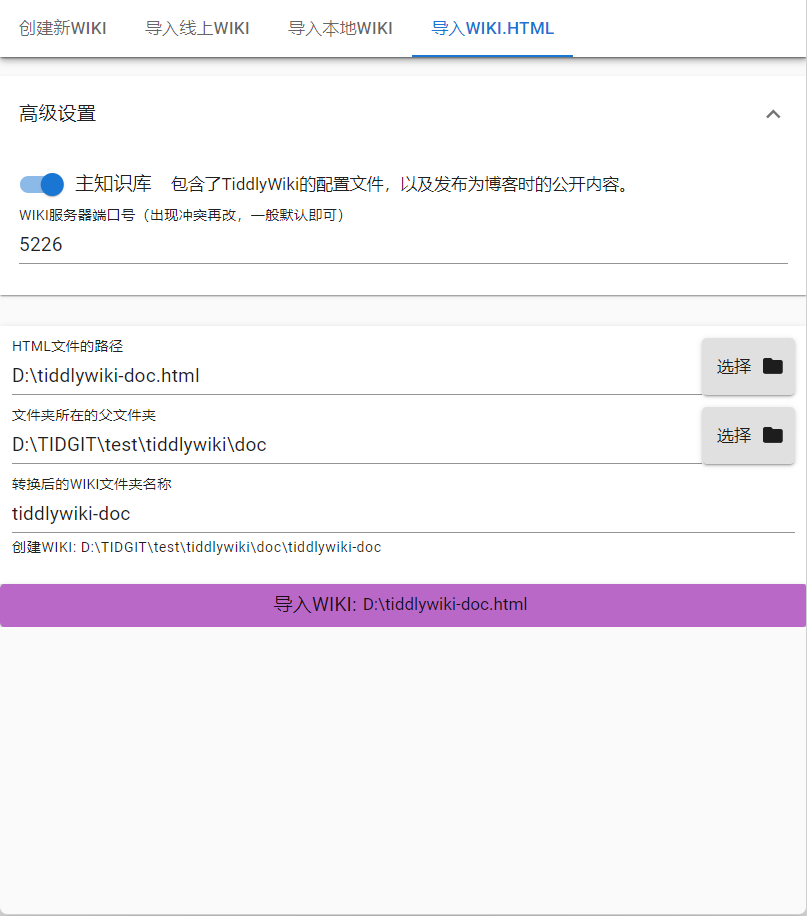
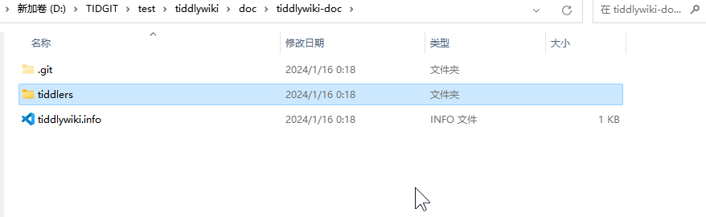

# 使用太记

安装之后正常加载太记。点击侧边栏里设置按钮，就是那个齿轮形状的图标，进入设置选项。

## 设置太记

重点是设置编辑者姓名和下面的交互。我个人的喜好是取消侧边栏图片，只展示文字就可以了。可以在左边点击不同选项设置。在系统里，可以设置开机自启。语言选择简中。下载可以更改下载位置。同步时间默认是半小时，可以改成一小时，或者十五分钟，来设置同步频率。github 同步则在下一节会讲。

设置编辑者姓名和同步时间都会**触发重启**。太记需要重启才能保存这些设置。

## 新建 wiki

点击旁边的添加，或者加号的图标，以此来新建 wiki 或者导入 wiki。在其中选择特定的文件夹，和 wiki 保存的名称。如下图所示。稍等一下就会加载出来了。

然后会弹出一个 cpl 窗口。阅读完成后，可以勾选，不再弹出此窗口，避免每次打开 wiki 都显示此窗口。如果想要查看，可以在侧边栏的搜索框中搜索`$:/plugins/Gk0Wk/CPL-Repo/readme`条目，就能再次查看了。

然后**右键 wiki，打开 wiki 工作区的设置**。从下面图片中可以看到有很多选项。后续我们会经常用到这一操作，但这里我们先只打开文件夹，来查看太记 wiki 的文件夹架构。

### 太记文件夹架构

从上面图片中可以看到，这已经是一个 git 仓库了。太记会使用 git 来进行版本管理。

其次，上面的文件都可以用 vscode 来打开。当然记事本也可以。但更推荐用 vscode 这种专业的代码编辑器查看。而安装 vscode 也非常简单，网络上有很多教程，随便搜索一下就能找到。

再次，所以在太记里操作 tiddlywiki 的数据都会保存到`tiddlers`文件夹里，你可以点击查看。如下图所示。以美元符号$开头的文件，通常是系统条目。而在太记中，系统条目和普通条目是放在一起的。这样是为了更好的保存数据。里面的 tid 文件可以用记事本打开，也可以用 vscode 打开。里面具体内容下节再分析。

### 导入本地 wiki 文件夹

太记在第一次安装时，会直接在桌面新建一个 wiki，如果想把这个 wiki 移到其他文件夹中。也很简单。在 wiki 右键中，选择移除工作区。然后选第一个就可以了。这样再到这个 wiki 文件夹，把整个 wiki 文件夹复制到你想要保存的文件夹中。在添加中，点击导入本地 wiki 文件夹。就可以实现转换了。

## 单文件版本导入

如果导入的是之前太记所构建的文件夹版本 wiki，那么在点击新建时，选择导入本地 wiki 就可以了，跟上面的内容基本一致。而之前是使用单文件版本，那么就要选择 html 导入方式了。

这里有三个选项。第一个选项是 html 文件夹路径。这里我是直接保存了一份官方中文文档在 D 盘里。第二个选项是要将这个 html 文件转换后生成的文件夹版本，选择保存位置。第三个就是文件夹名称了。

然后我们右键此 wiki，打开文件夹。发现里面只有一个 git，一个 tiddlers 文件夹和一个 tiddlywiki 的 info 文件。而只有这些文件是不能够发布到 github 上的。所以如果你需要发布到 github 上，那么你需要把 tiddlers 文件夹里的文件，全部复制到一个新的太记默认模板里，可以覆盖掉模板里的文件。

这种方式有一个好处是，可以避免重复文件。
