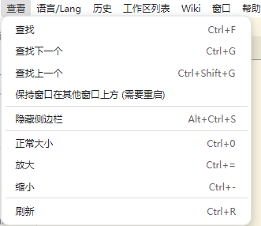
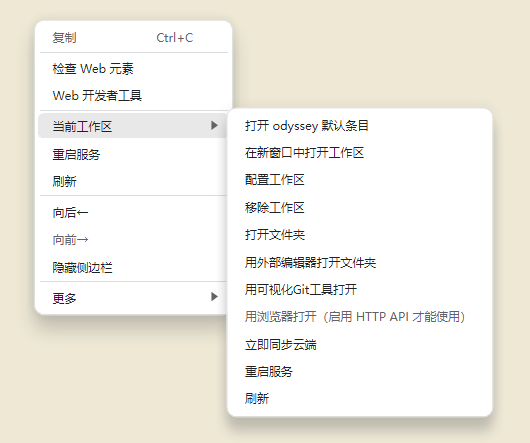
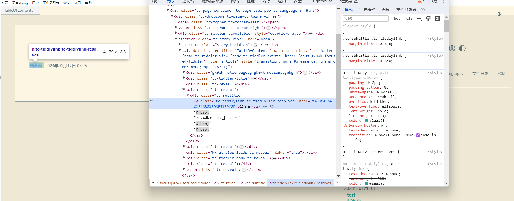
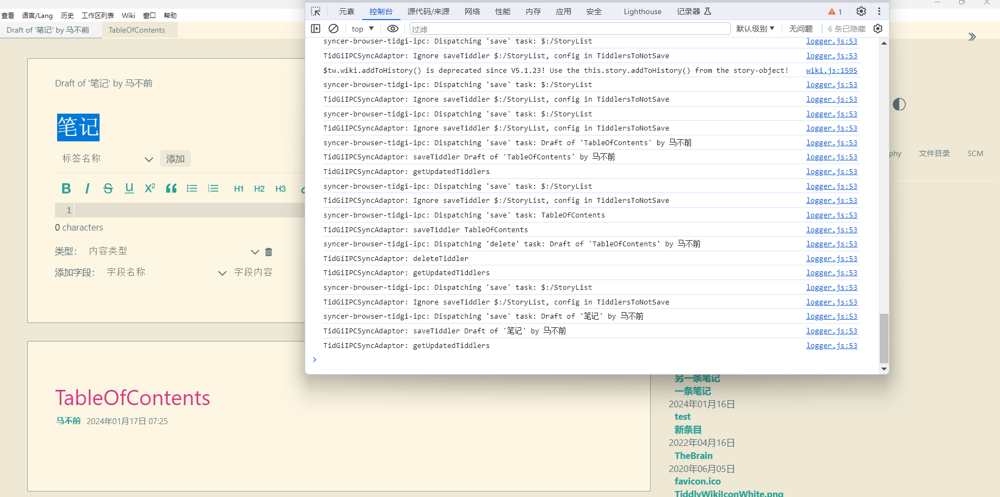
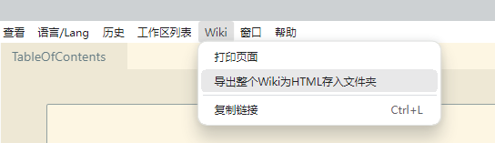
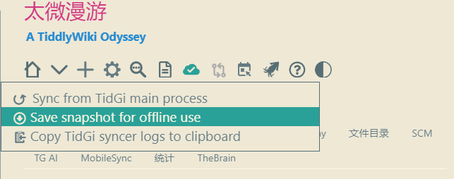

# 太记小技巧

## 缩放 wiki

太记是自带缩放功能的。之前都没发现。虽然不像浏览器那样直接使用鼠标滚轮方便，但也可以正常缩放了。缩放通常是为了截图时更方便一点。省得截两张图或者搞滚动截图。当然如果是太长的条目，也有其他插件可以导出图片的。这个后面会介绍。

## web 开发者工具

同样，还可以直接在页面上右键，下面图片中展示的是使用当前工作区的一些功能。和右键侧边栏的 wiki 展示出来是一样的。这些功能不过多介绍，主要是打开 web 开发者工具。

下面图片就是一个使用元素查看样式的示例。

下面是一个查看控制台的示例。如果 tiddlywiki 或者太记出现了问题，会在这里看到红色报错部分。可以给开发者提供截图，以便更好排查错误。这里没有问题，只是记录了编辑一个“笔记”的条目的 log。

## 导出整个 wiki 为 html 文件

太记还可以导出整个 wiki 为 html 文件。有两种方式，分别截图演示。

直接在顶部 wiki 中，选择导出整个 html 文件存入文件夹，然后就会弹出选择保存文件的文件夹了。如果在设置中设置不需要每次询问保存地址，就会直接存入到选定的文件夹中。文件夹名称是你的 wiki 在侧边栏的名称。保存之后的 html 文件是可以正常打开的。你可以用这种方式把这种笔记分享给你的朋友。

另一种方式是在太微内部点击保存。这是 nodejs 的一个保存功能。点击云朵图标，然后选择第二个选项，表示导出整个备份。然后就会导出一个 html 文件了，这时的名称是`tiddlywiki.html`的形式。两者就是名称上的不同，但都能正常打开使用。

