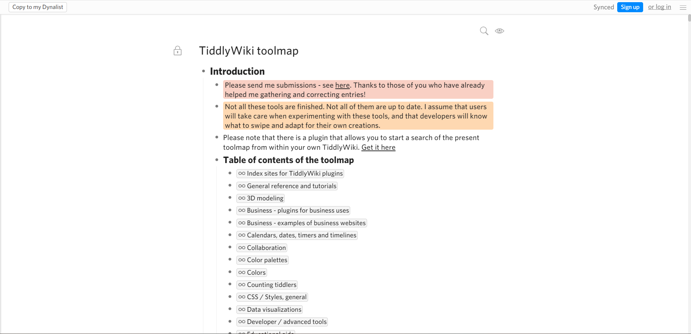

# 社区资源

## Tiddlywiki Links

- Site: https://links.tiddlywiki.org/
- Code: https://github.com/TiddlyWiki/TiddlyWikiLinks

内容为全英文。本网站是一个由我们的社区编辑团队策划的有用和有趣的 TiddlyWiki 材料的链接集合。本网站汇集了由 TiddlyWiki 社区个别成员策划的链接。它让你看到最新的链接，并通过分类和时间线来探索它们。

这个网站在有一群人发布链接的情况下效果最好。个人的压力减少了，因为不是每个人都需要抓住每一个飞过的有趣链接。聚合效应减少了错误的影响。例如，如果一个人在一个不恰当的主题下错误地标记了一个链接，该网站将显示只有一个人添加了这个标签，而大多数人使用了更合适的标签。通过这种方式，我们希望出现一种群众的智慧，在描述和分类链接的最有用的方法上达成共识。

- [如何向本网站提供链接](https://links.tiddlywiki.org/#Contributing)
- [了解本网站背后的工程原理](https://links.tiddlywiki.org/#Documentation)

在导入链接的过程中，一些主题被合并和重新标记。在这里阅读更多信息：[主题地图指南](https://links.tiddlywiki.org/#Topics%20Map%20Guidelines)。也可以下载以原始 tiddlers 的形式提供的[JSON 文件原始数据集](https://links.tiddlywiki.org/tiddlers.json)

## TiddlyWiki toolmap

- Site: https://dynalist.io/d/zUP-nIWu2FFoXH-oM7L7d9DM

收集了很多插件。但没有 [CPL](/plugins/CPL.html) 收集全面。内容为全英文。

## TiddlyWiki/Dev

- Site: https://tiddlywiki.com/dev/
- Code: https://github.com/Jermolene/TiddlyWiki5

开发者文档，内容为全英文。

## TW-Translation-Chinese

- Site: https://tiddly-gittly.github.io/TW-Translation-Chinese/
- Code: https://github.com/tiddly-gittly/TW-Translation-Chinese

对上面开发者文档的翻译。好久没更新了。

