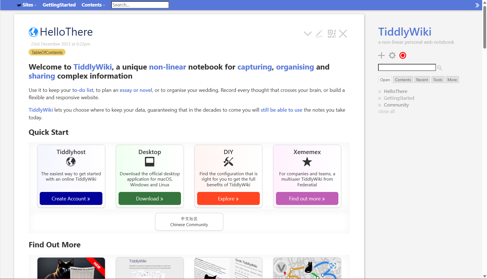
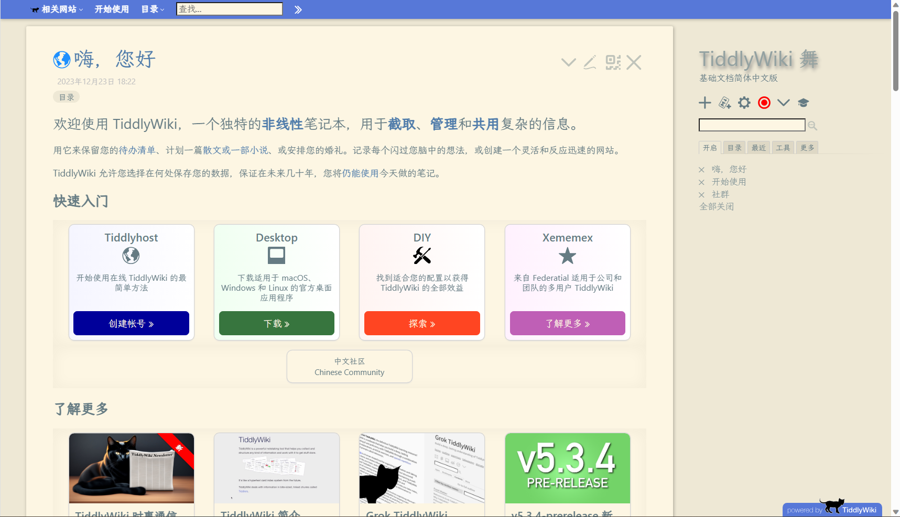
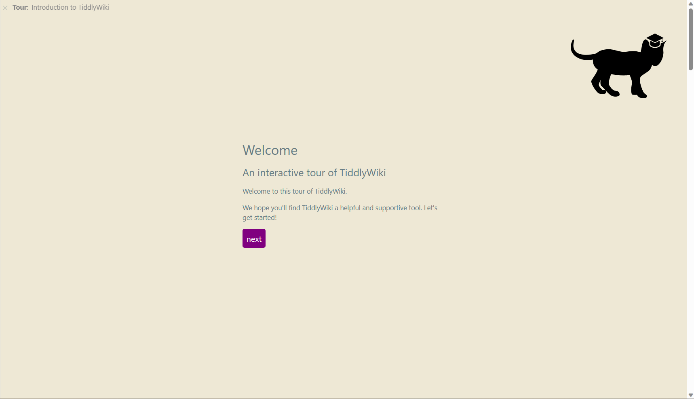

# 官方文档

## 英文文档

- Site: https://tiddlywiki.com/
- Code: https://github.com/Jermolene/TiddlyWiki5

这是 TiddlyWiki 官方文档，但语言是英文。英文好的也可以查看这个文档。

## 太微中文-舞

- Site: https://bramchen.github.io/tw5-docs/zh-Hans/
- 繁体: https://bramchen.github.io/tw5-docs/zh-Hant/
- Code: https://github.com/BramChen/tw5-docs/

这是由爱好者翻译的。上面贴的是简体版本链接，同时也有繁体版本链接。可以查看。一般来说，我就是在这里查看这份文档的。这份文档更新内容非常及时。通常官方文档更新的内容，一天后就能看到翻译版本。而且是从 2011 年还是 2012 年就开始维护了，维护了超过十年。

## Tour

官方最近推出了一个新手引导。点击侧边栏的帽子按钮就可以进入到这个旅程中。内容是英文，但不难，可以体验下，也介绍了很多功能。是由插件`$:/plugins/tiddlywiki/tour`提供的。

