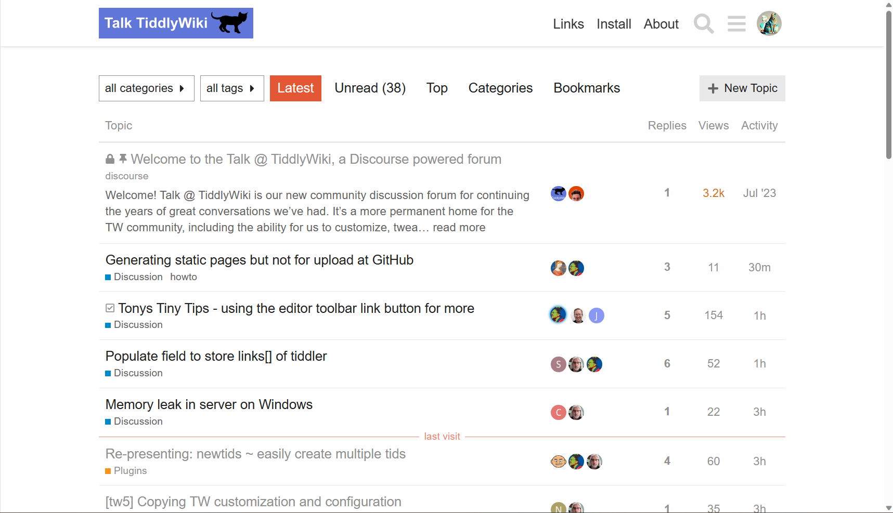
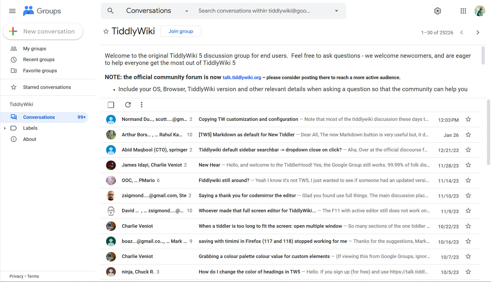
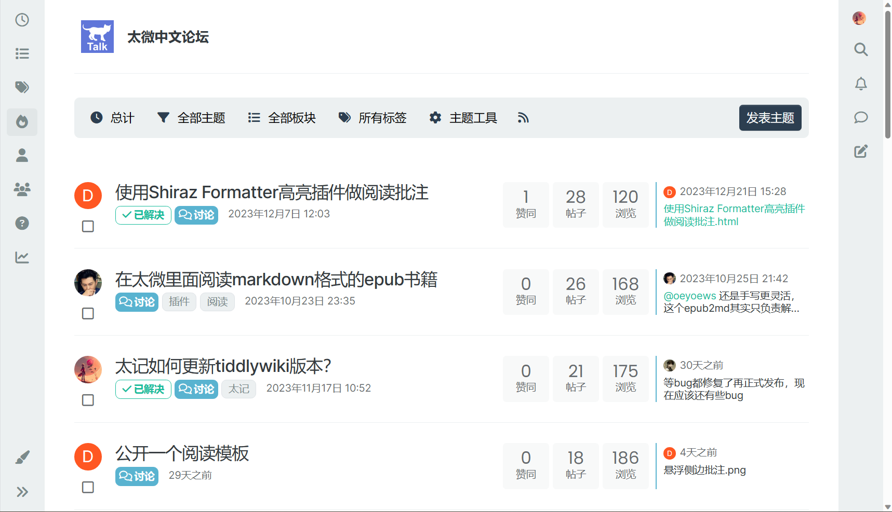

# 论坛

## 官方论坛

- Site: https://talk.tiddlywiki.org/

内容是英文的。但你可以开浏览器翻译查看内容。里面非常友好，可以随意提出任何有关 tiddlywiki 的问题，会有人回答的。你也可以在这里查看其他人提出的问题，也能收获很多。

我几乎每天都会上去看一看。虽然不是所有帖子都会看，但一些技巧相关的可以看一看。也经常在这里搜索官方文档写的不详细的内容，补充理解。

如果英文不好，可以使用[deepl](https://www.deepl.com/translator)，先写一遍中文，再看翻译的内容，觉得没问题就可以发过去。当然现在 AI 很方便，也可以让 AI 帮助你翻译，然后发过去。总之多交流，不要因为语言的阻隔而放弃。

## 谷歌论坛群组

- Site: https://groups.google.com/g/tiddlywiki

上面的官方论坛是 2021 年搭建的。而在这之前，都是在上面的谷歌论坛群组中讨论的。因而可以说保留了绝大部分论坛资料。现在很少人在上面发帖子了，但也有少部分用户一直在上面发帖。里面的资料是可以查看的。

## 太微中文论坛

- Site: https://talk.tidgi.fun/recent

太微中文论坛是在 2023 年 10 月搭建的。之前的讨论内容基本上在 QQ 群和整理到太微中文教程中去了。同样，我也几乎每天都会上去查看。也会在上面活跃，发帖子。

我觉得论坛这种形式比 QQ 群要更好。论坛可以保存资料。其次论坛是用户感兴趣的人去查看对应的帖子，而不是对所有用户都发消息一样。

