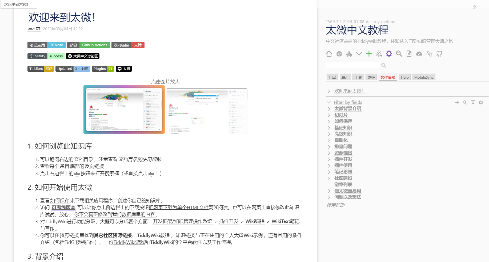

# 太微中文教程

- Site: https://tw-cn.netlify.app/
  - [太微中文社区教程加速访问](https://tw-cn.cpolar.top/)
  - [太微中文社区教程备用](https://tiddly-wiki-chinese-tutorial.vercel.app)
- Code: https://github.com/tiddly-gittly/TiddlyWiki-Chinese-Tutorial

这是由太微中文社区共同编写的太微中文教程。上面三个链接内容都是一样的，只是访问速度有差异。

如果想要为太微中文教程作贡献，可以去 QQ 群中找林一二，把你的 Github 账号名称发给他，他会为你开权限。或者也可以在 issue 中留下评论。

## TiddlyWiki 简易指南

- [知乎文章](https://zhuanlan.zhihu.com/p/555893660)
  - [PDF 版](https://github.com/tiddly-gittly/TiddlyWiki-Easy-Guide-to-TiddlyMemo-Edition/releases/latest/download/TiddlyWiki-Easy-Guide.PDF.pdf)
  - [思维导图](https://www.zhixi.com/view/70759713)
- Code: https://github.com/tiddly-gittly/TiddlyWiki-Easy-Guide-to-TiddlyMemo-Edition

简单指南主要是通过简单介绍 tiddlywiki 和使用方式，以达到快速上手使用的目的。在知乎上就可以查看，非常方便。

## B 站直播

- Site: https://space.bilibili.com/437823

太微中文社区曾经举办过 B 站直播。时间是每周六晚上九点。但现在已经没了。存档可以在林一二的 B 站空间查看。即上面的网址。里面还有两次杰里米来访问的存档。
