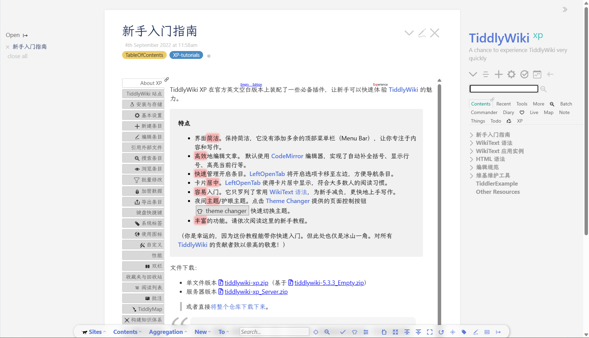

# TiddlyWiki XP

- Site: https://keatonlao.github.io/tiddlywiki-xp/
- Talk: [论坛介绍](https://talk.tidgi.fun/topic/8/tiddlywiki-xp-%E4%B8%80%E4%BB%BD%E6%95%99%E7%A8%8B-%E4%BD%86%E4%B8%8D%E4%BB%85%E4%BB%85%E6%98%AF%E6%95%99%E7%A8%8B)

TiddlyWiki XP 是最适合新手入门的教程。同时也有很多插件值得学习。下面是论坛介绍中摘录的作者自述。作者自述肯定比我写的要好。

## 为什么起名 XP？

当我遇见 TiddlyWiki 时我就爱上了它，一见钟情。这种独特的卡片式风格的笔记，令我着迷。于是我开始学习 TiddlyWiki，做很多学习笔记、去找很多插件、以及大量折腾以使维基用起来更加顺手。突然有一天，我心想：“我花了这么多时间，做了这么多折腾，应该分享出去，或许可以帮到其他学习 TiddlyWiki 的人。”于是我整理了学习笔记，并思考为它取一个合适的名字。直接叫 TiddlyWiki 教程或者学习笔记不合乎我的心意，我要为这份教程找一个合适的「代号」，不搞独特，找那种越简单越是众所周知的代号越好。当时想到了 Windows XP，这个「XP」是 experience 的缩写，尽管内心有个小小的声音说：用 XP 很老气会让人觉得过时，但总体上我觉得用 XP 很合适，因为这个教程就是学习体验 TiddlyWiki。

## XP 的理念是实用

实用就是内容部分少讲理论多讲案例，让大家多看案例用法，你觉得这个用法适合你，就直接拿去用，减少新手学习负担。

实用的目的是希望你学习时得到正反馈，你看案例你就有收获，不浪费你的时间。

实用就是 XP 不一定要长得很好看，但一定要用起来方便好用。

