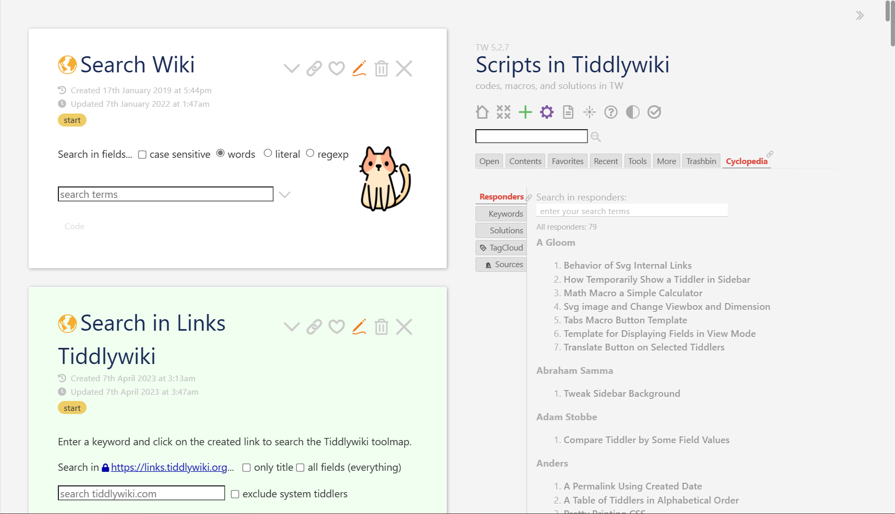

# 技巧教程

## Scripts in Tiddlywiki

- Site: https://kookma.github.io/TW-Scripts/

由库克马收集编写。包含了各种太微使用技巧。强烈推荐查看学习。你可以进一步发挥太微的作用和功能。但内容是英文的，你可以开浏览器翻译进行查看。

## 正则表达式

- Site: https://tw-regexp.tiddlyspot.com/

:::tip 正则表达式简要介绍
正则表达式(Regular Expression)是一种文本模式匹配的工具。它使用单个字符串来描述、匹配一系列符合某个句法规则的字符串搜索模式。

正则表达式的基本语法元素包括:

- 普通字符 - 直接匹配字符
- 特殊字符 - 例如\.匹配点,`\\`匹配反斜杠
- 字符类 - [abc]匹配 a 或 b 或 c,[a-z]匹配任意小写字母
- 锚点 - ^表示行的开始,`$`表示行的结束
- 数量词 - `*`表示 0 个或多个,`+`表示 1 个或多个,`?`表示 0 个或 1 个
- 分组 - 通过()`标记子表达式
- 反义 - \反转特殊字符的意义

正则表达式的主要作用:

- 验证输入数据合法性
- 查找匹配特定模式的文本
- 文本替换
- 文本解析和格式化

正则表达式在处理字符串操作时非常强大和灵活,在许多编程语言和文本编辑器中都有广泛的应用。熟练掌握正则表达式可以大大提高开发效率。
:::

在上面的教程中，介绍了很多在太微中使用正则表达式的方式，非常推荐学习掌握。熟练使用正则表达式，可以让你在太微中发挥更多的功能。同样内容是英文的。

