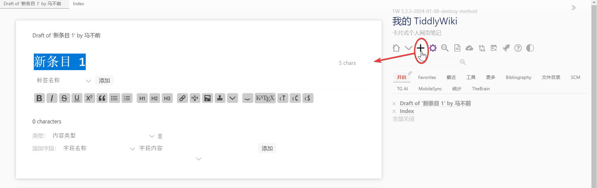
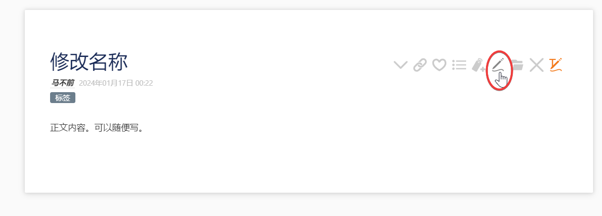
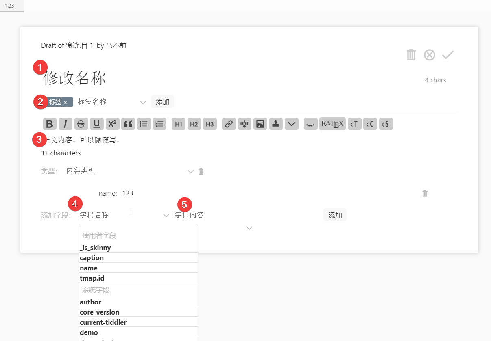
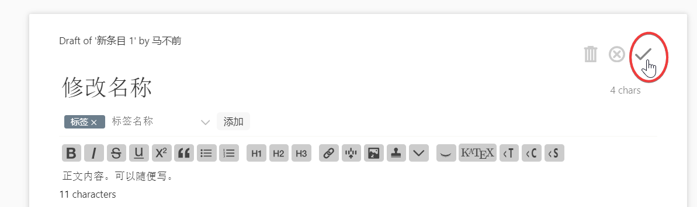
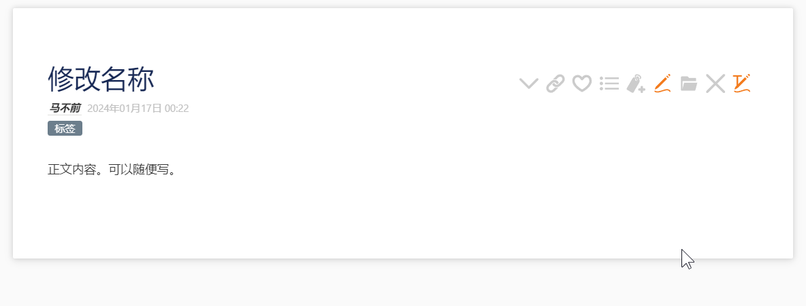
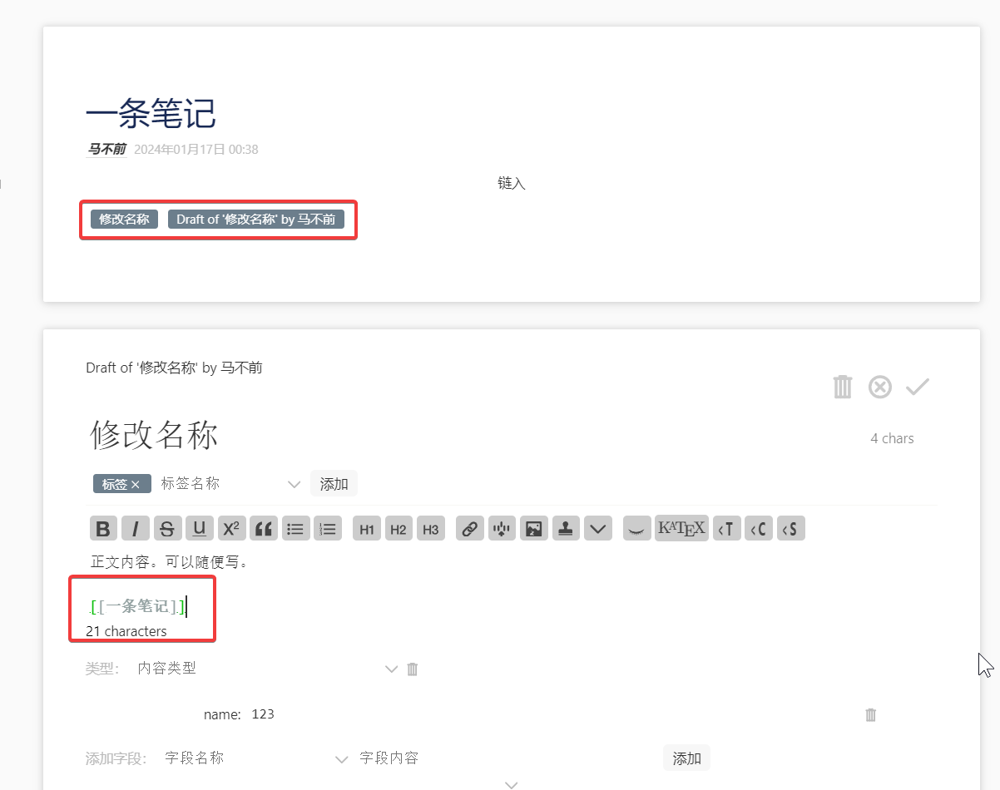
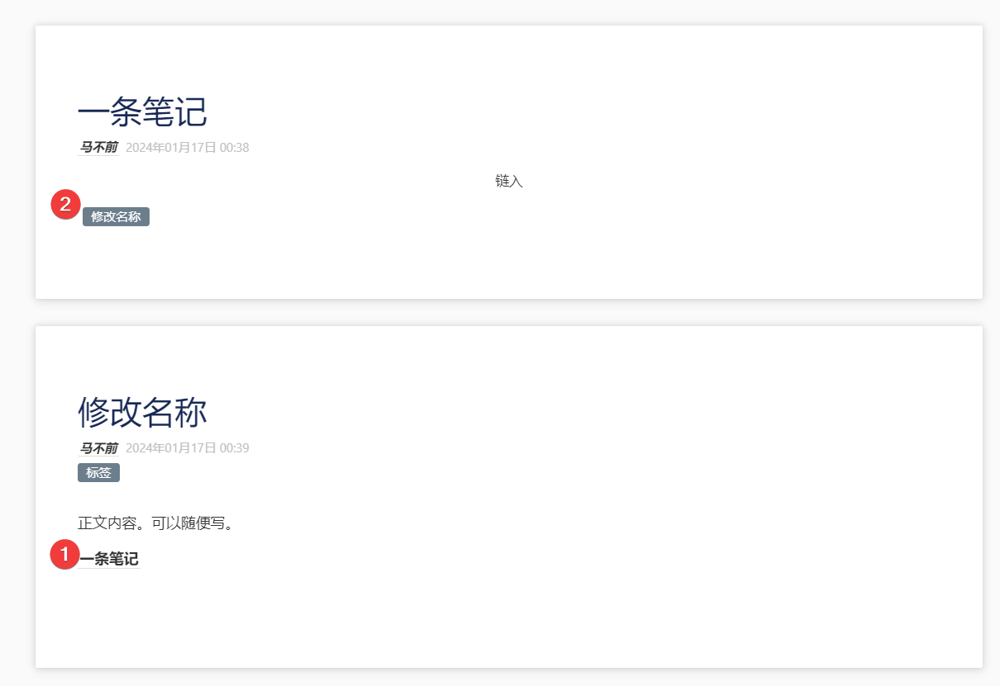
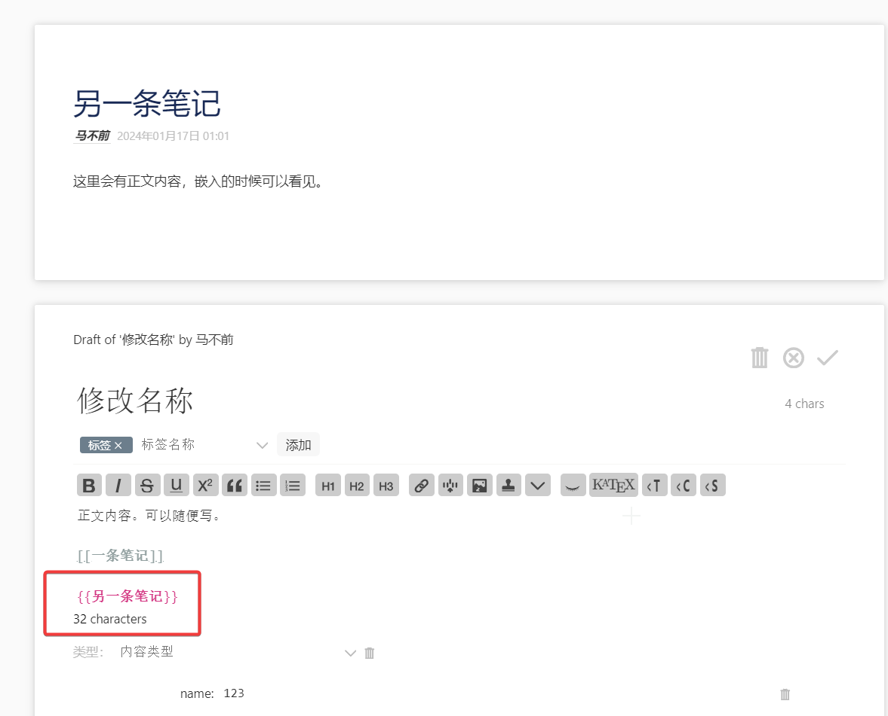
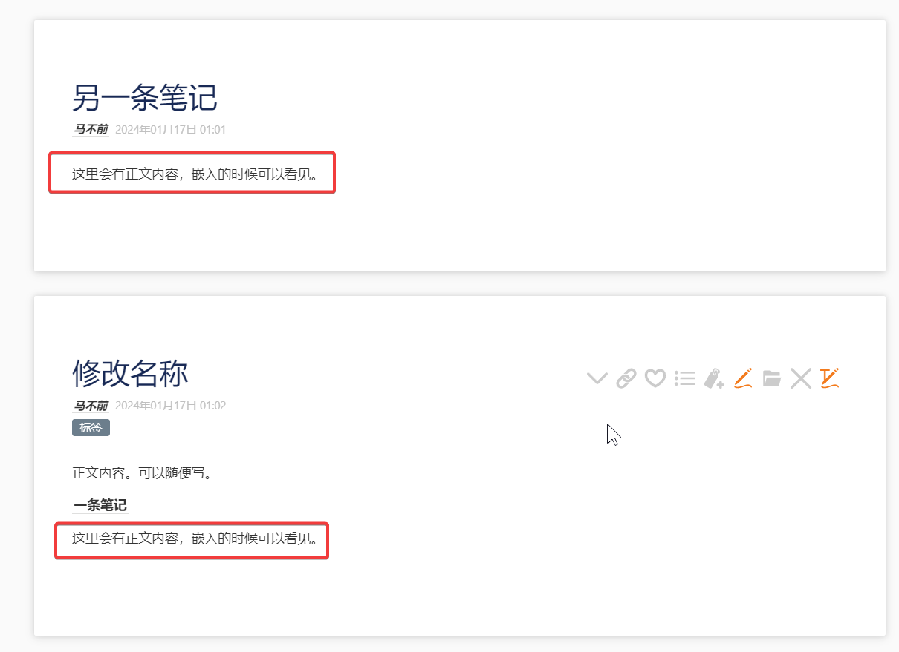

# 基本编辑

这里只介绍一下基本编辑的方式，而不过多探讨。其他内容要放到插件里或者自定义里讨论。

## 新建条目

新建条目非常简单，只需要在侧边栏里，找到一个加号的图标，点击，就会在左侧显示一个条目了。如下图所示。

## 编辑条目

编辑条目也很简单。这里因为是新建条目，所以直接展示成编辑状态了。如果没有展示成编辑状态，点击页面上的编辑按钮，如下图所示，就一样可以进入编辑状态了。

只需要把鼠标移动到标题上，就可以编辑标题。移动到标签上，就可以进行打标签。写好了标签点击旁边的添加就会添加标签。也可以在下列展示中，点击选择添加。然后是正文，正文也一样可以随便写内容。类型目前不用填写。

字段则是看需求填写的。字段分为两类，一类是系统字段，一类是用户字段。区别在于系统字段在筛选器或者性能方面有优化，因为会经常使用。而用户字段则是由用户和插件自定义的字段。用户可以自己定义字段，也可以使用下面的字段。字段其实上是键值对，而键值对可以更好地保存数据。当然如果没有需要也可以不添加。这里只是演示添加了一个 name 字段，值为 123，旁边还有个删除字段的按钮可以使用。除非特殊自定义，不然字段内容不会显示在正文里。

## 保存条目

保存条目也非常简单，只需要点击上面的打勾图标就可以了。其他两个图标按钮，一个是删除这个条目的意思。一个是取消对条目的更改的意思。

保存条目还有个快捷键，按住`ctrl+回车`即可保存当前编辑条目。如果有两个及以上的编辑条目，则哪一个在故事河前，哪一个就会被保存。其余的不保存。

保存之后，条目大概就如下图所示，就长这样了。

## 链接

在 tiddlywiki 中，你可以使用`[[]]`来进行链接条目。下图里，在正文编辑中就使用了这种方式，链接到`一条笔记`这个条目里。

这里暂时不演示反链是如何构建的，因为太记默认模板自带了一个能够实现反链的插件。可以从一条笔记这个条目下面看到，有另一个链接存在，这就是反链的形式。

## 嵌入

嵌入是指把某个条目的内容（可以是正文内容，也可以是字段内容）嵌入到另一个条目里展示。这个设计的目的是为了提高条目的可复用性。如果条目写得像一个个概念一样，非常整洁干净，清楚明了，那么在其他条目里就可以很自然的引用。相反，就不好嵌入过去了。

嵌入的简写形式是`{{}}`，用双花括号来嵌入，里面写上条目的标题。

可以在下图中看到嵌入效果。

掌握上面这些内容，你就可以正式开始使用你的 tiddlywiki 里，你可以大胆编辑条目，修改条目，通过链接和嵌入的形式组织条目。
