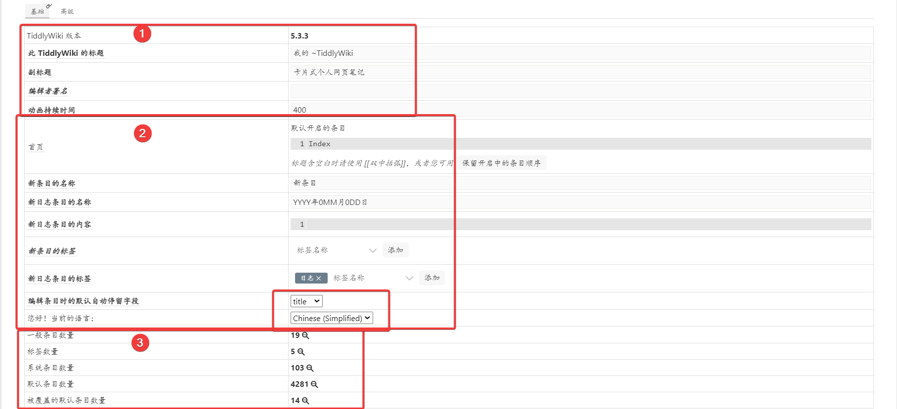
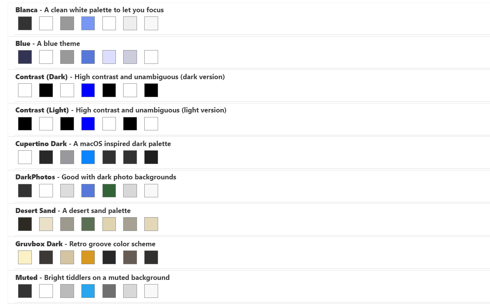

# 控制台

要想使用好 tiddlywiki，首先是要设置好。而且要了解设置。你可以点击侧边栏的齿轮按钮进入到控制台条目，也可以搜索`$:/ControlPanel`条目进入。下面是对控制台进行分区介绍。新手一定要重点了解控制台内容。不了解控制台就相当于不了解游戏里的技能。当然这里不会太深入，但一些必要的信息还是要了解的。

## 信息

在信息里，点击基本。就是基本设置的内容了。高级目前不需要关心，后续在进阶内容里会介绍。

这里我是从网址上截图的，所以版本号跟太记本地的版本号不一样。把基本分成了三个部分。下面就从三个部分开始介绍。

### 基本设置

第一个部分基本上就是自己设置，编辑。比如标题与副标题，设置了就会在旁边展示。这里我设置跟本文档一样的标题好了。编辑者署名，这里可以新建一个条目，来保存。比如我通常署名`马不前`，然后新建一个条目，标题为马不前。在条目展示的时候，就会显示这个编辑者的链接。动画持续时间，我通常是设置为 0，感觉这样会快一点。默认 400 总感觉卡顿。当然设置成 400 是为了加载时一个缓冲。但设置成 0 也挺好。

### 编辑设置

第二个部分则是会对编辑产生影响的。比如首页开启条目。这里设置的是 index，但依据我个人的习惯会把这个条目删除，然后改成 TableOfContents。当然你也可以点击下面保留开启条目按钮。这样首页中展示的就是每次在故事河中展示的内容了。新条目的名称，是每次新建条目时，默认的条目名称是什么。这里我修改成`笔记`，这样每次新建条目，就会是`笔记 1`这种格式了。日志标题格式则看自己喜好了。一般默认的就行。下面两个标签设置，也是给新建条目时，会附带上的标签。比如新建日志条目，就会自动添加上日志标签。而且日志条目内容也可以预先设置一定的模板。

下面一个小方框中圈起来的，一个是编辑时停留的位置。可以修改成正文，也可以修改成标签。这样新建条目时，就会自动把光标停留在正文或者标签里了。另一个语言设置。这里太记模板是自带了语言插件，所以展示的中文。而默认的则是英文，可以在这里切换。

### 简单统计

第三个则是自带的统计。可以查看一些数据。比如一般条目数量，标签条目数量等等。点击旁边的筛选器会自动跳转到搜索框中展示。

## 外观

外观是修改 tiddlywiki 样式非常重要的一部分。这里对重要的内容进行介绍。

### 调色版

太记模板默认的主题是 itonnote，而这个主题默认的样式是 notion。notion 这个样式确实挺好看，但你也可以试试其他的样式，看看有没有满意的。下面会显示可以编辑样式。确实，你可以选择一个样式之后，进行编辑。但不建议这样做。因为要搞一个统一的样式是很难的，除非你有技术背景，不然调整起来可够累的。如果你一定要编辑一个自己的样式，那你最好是复制一个条目再在这个复制的条目上进行编辑。一些插件还会提供切换白天与黑夜样式的按钮。这个等具体到插件上再论述。

### 工具栏

#### 编辑器工具栏

#### 编辑工具栏

#### 页面工具栏

#### 查看工具栏

### 主题调整

### 其他内容

#### 视图模式

#### 布局主题

#### 布局

#### notion 与 xp

## 设置

## 保存

## 插件

## 快捷键
