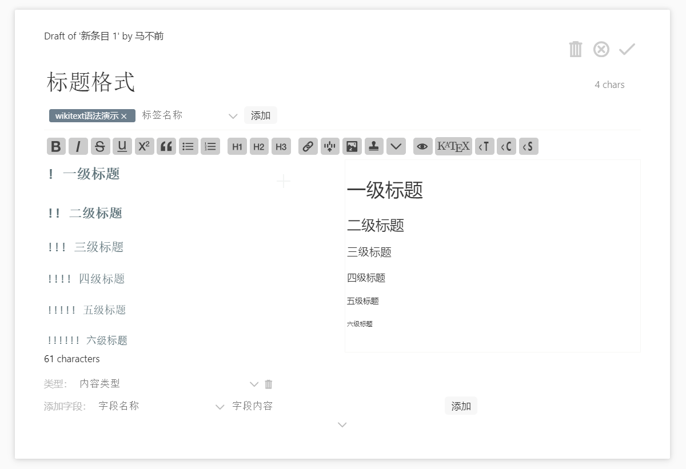
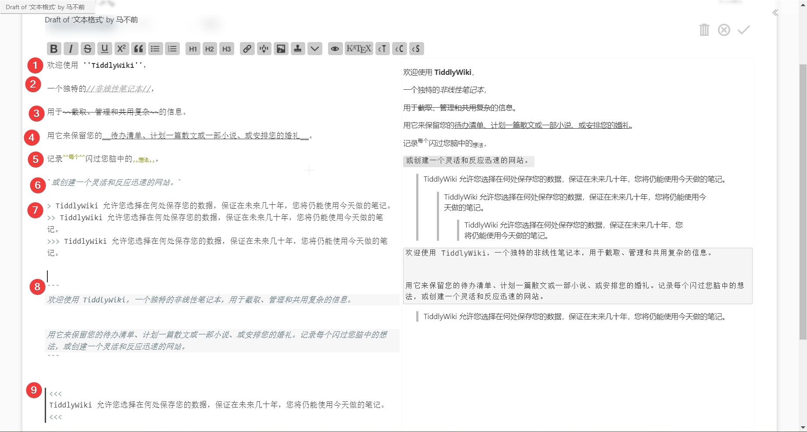
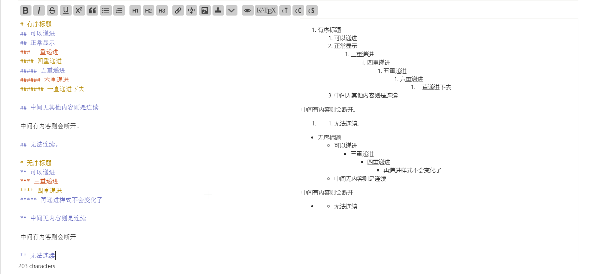
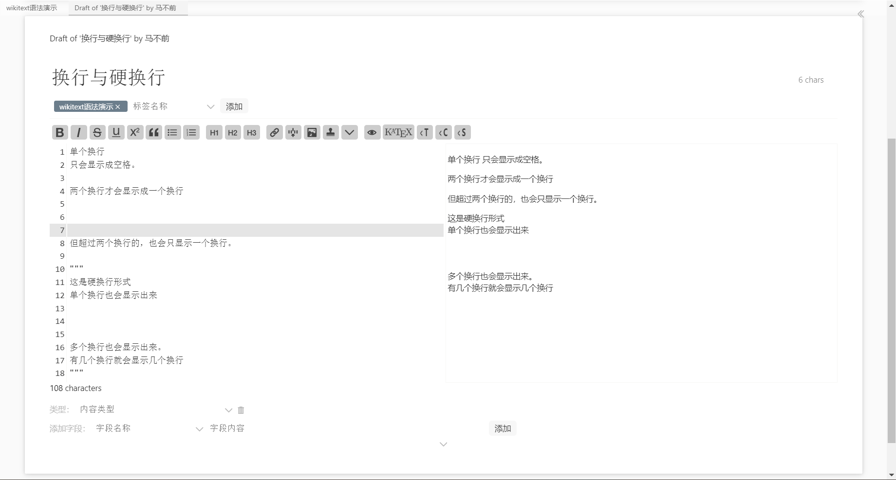
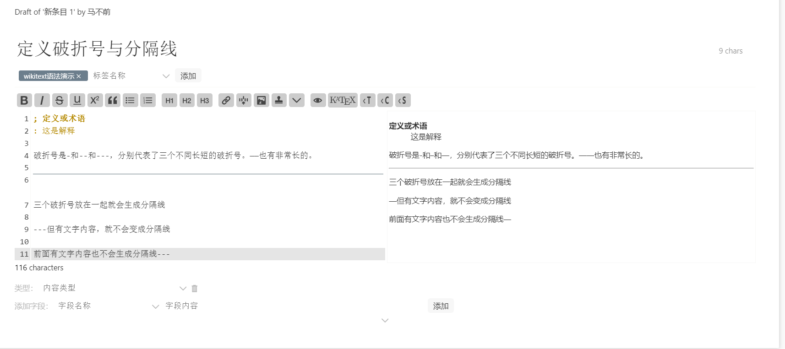
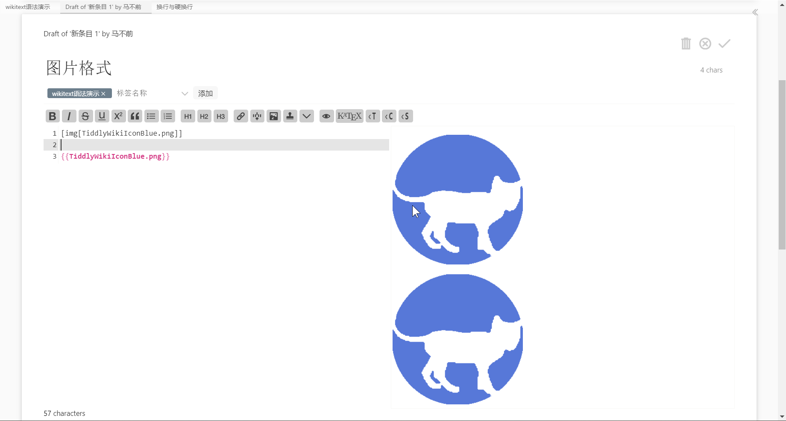
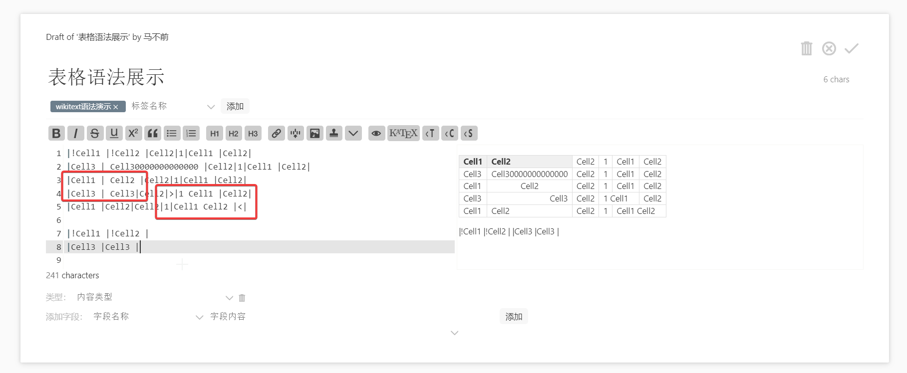
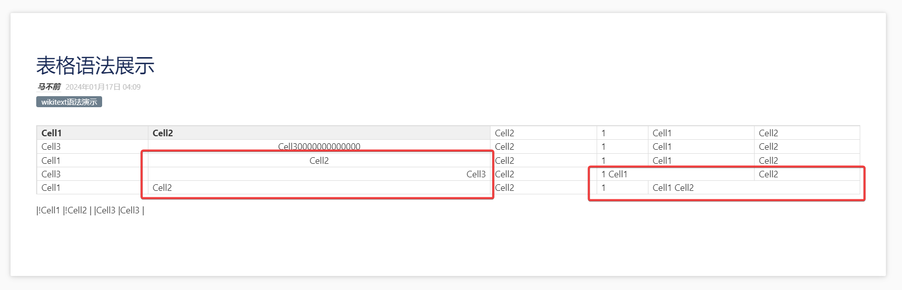
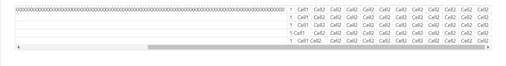

# WikiText

这里只对 wikitext 作一个简单的介绍，详细内容可参考[官方文档](https://bramchen.github.io/tw5-docs/zh-Hans/#WikiText)。

简单来说，wikitext 的标记语法和 markdown 非常相似。但与后者不同的是 wikitext 可以直接在正文里写程序代码，甚至是运行代码。而这一点 markdown 只能通过 mdx 语法来集成。tiddlywiki 中自带了一行编辑栏按钮，可以很方便的点击按钮来增加格式。并且这些格式大多可以嵌套使用。

## 标题格式

wikitext 的标题格式和 markdown 很相似。markdown 是用`#`来表示几级标题的。而 wikitext 则是用`!`英文感叹号来表示几级标题的。同样，两者都支持最大可达六级标题。下面是图片展示。

## 文体格式

文体格式也十分相似。但具体使用的符号不一样。wikitext 同样可以实现加粗，斜体等。下面跟着图片一一介绍。

1. 加粗
2. 斜体
3. 删除线
4. 下划线
5. 上标与下标
6. 代码或者等距
7. 引号。可以多级传递下去
8. 多行代码，也称多行等距
9. 另一种形式的引文

## 有序列表与无序列表

还是符号不一样。其他的类似。基本能做到一直连续下去。

## 其他

### 换行与硬换行

在 tiddlywiki 中，单次换行是相当于空格的作用。需要两次换行才能表示换行了。而对于一些特殊的格式，如诗歌，需要保持单个换行的话，也就是硬换行，需要用`"""`包裹起来。具体如下图演示。这里为了展示换行，我先把行数展示和高亮当前行打开了。

### 定义破折号与分隔线

这个没什么太多要介绍的，看图就能明白了。

### 图片

图片的话，有两种方式。一种和上篇文章说的嵌入一样，相当于把正文嵌入进去了。即`{{}}`。

另一种方式是用`[img[title]]`来实现的。注意这里的 title 要和图片条目的名称相一致。如果图片条目名称有后缀的话，那这里也要加上。

一般来说，是不太推荐存储太多的图片在 tiddlywiki 里的。因为 tiddlywiki 最终都会把这些图片文件打包进 html 里。现在一张图片通常都有 2m 左右大小。随便放十张图片就有 20m 了，很容易影响性能。因为如果是要写 20m 的文本的话，那估计得写好几百万字。

因而如果是作美术方面的，可能 tiddlywiki 不适合用来管理图片等文件。至于如何引用外部资源文件，以及太记在这方面是如何优化更新的，就在后面再写，这里不过多阐述。

### 表格

表格相对来说复杂一点。这里也只会简单举例说明，详细的请看[官方文档](https://bramchen.github.io/tw5-docs/zh-Hans/#Tables%20in%20WikiText)。

简单来说，就是通过`|`来搭建一个表格。然后通过空格符号来控制里面的内容是居中还是靠右对齐。默认是靠左对齐。最后的`|`不能再添加空格，不然表格就会失效。

下图两个方框中的内容，一个是展示了如何在内容里，通过添加前后空格来达到居中效果。如果是靠右对齐，就只需要在后面添加一个空格。另一个是展示了如何合并两个单元格。是通过`>`或`<`来合并前一个单元格或者后一个单元格的。

而表格在正文中是默认宽度 100%的，如果想要改成其他宽度就需要用代码调整了。

如果表格非常长，那么就会展示出滚动条。这一点应该是新版本改进了，以前是会直接冲出条目框架的。

其实不管是 wikitext 还是 markdown，表格都不好写。虽然后面会介绍其他插件来帮助改进这一点，但总的来说，不建议在 tiddlywiki 里手写复杂表格，维护起来也是相当困难的。更建议是做好了表格再截图保存过来。或者用插件实现转换过来。
