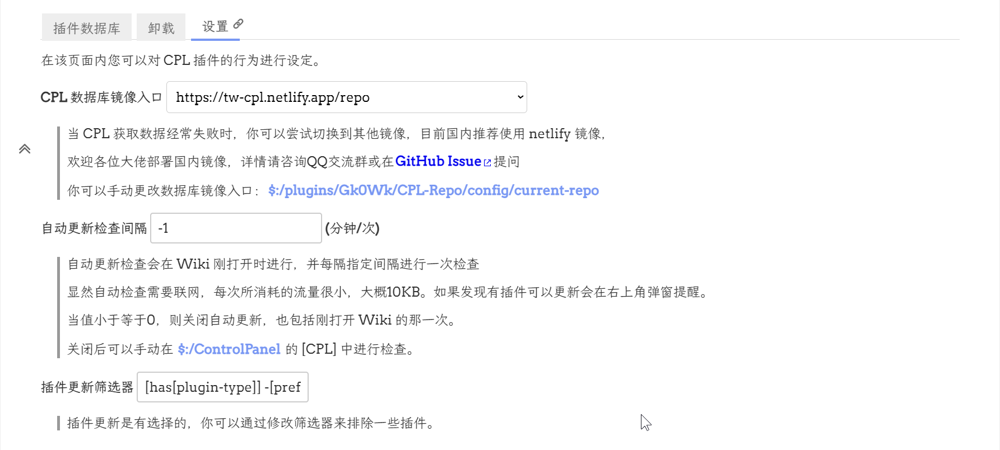

# CPL

## 什么是 CPL

- Site: https://tw-cpl.netlify.app/
- Code: https://github.com/tiddly-gittly/TiddlyWiki-CPL

CPL(Chinese Plugin Library)是太微(TiddlyWiki 的汉语昵称)中文社区一大力作，收集百款插件(还在不断变多)，你可以在这里寻找想要插件、为插件添加评论，更可以推荐添加你想要的插件。同时 CPL 提供插件源，你只需要将一个小小的 tid 条目拖到你的 Wiki，就可以一键安装、更新所有插件！

CPL 是基于 GitHubAction 的自动更新部署系统，每小时检查所有记录的插件的版本状态，保持插件库中所有插件保持最新状态。

## 谁来维护 CPL

通常是由太微中文社区的开发者维护的，但普通人也可以在 github 仓库里提交 issue 来推荐插件，以便更方便收录进去。

## 怎么使用 CPL

你可以从上面的网站里导入`$:/config/TiddlyWiki-CPL/GitHub`或者`$:/config/TiddlyWiki-CPL/Netlify`条目，然后和上篇如何使用库里一样安装 CPL 中的插件。

也可以安装`$:/plugins/Gk0Wk/CPL-Repo`插件，这样就能使用新版 CPL 了。在第一次安装时，会弹出窗口，简要介绍如何使用 CPL。可以勾选上面不再展示的按钮。这样下次打开时就不会再展示。

接着就是从`$:/ControlPanel`条目，在`CPL`，点击加载数据库，就可以直接在下面搜索插件和安装插件了。旁边是卸载插件。这里卸载插件会弹出提示，是否要卸载插件余留的影子条目。可以进一步勾选卸载或者保留。

这里可以设置自动更新检查。图片中没有设置。因为我更喜欢手动更新插件。自动更新检查开启后会在插件更新时，弹出窗口提示更新插件。

还可以在下面排除一些不想要更新或者不想要安装的插件。
