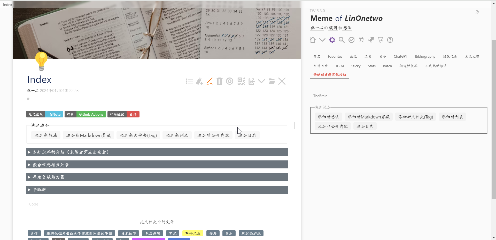
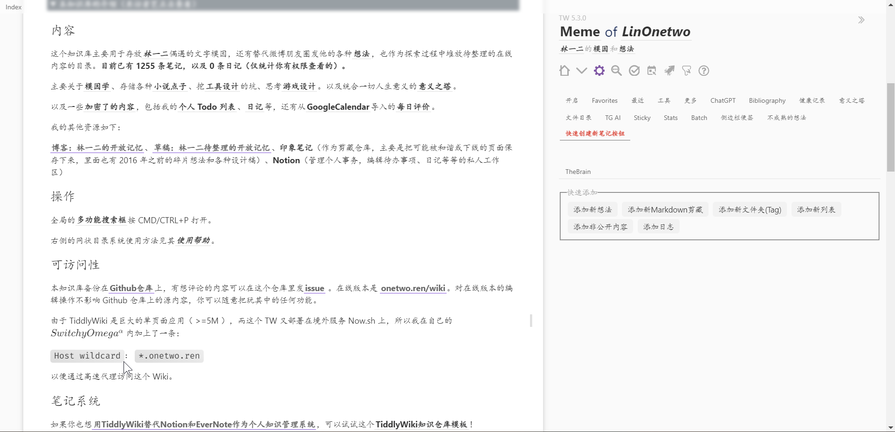
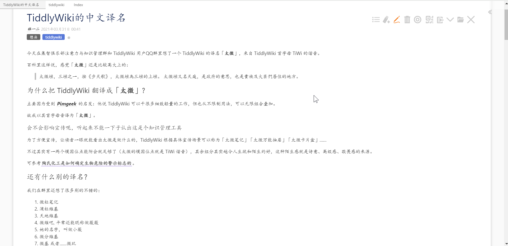

# 林一二的模因和想法

- Site: https://wiki.onetwo.ren/#:Index
- Code: https://github.com/linonetwo/wiki

太记开发者，太微中文爱好者群群主，太微中文社区发展的领导者。开发了大量美化和简化入门的插件。tiddlywiki 中文名称太微，也是由他想出来的。

通过推广预置这些插件的太记，来降低新人入门的门槛。

